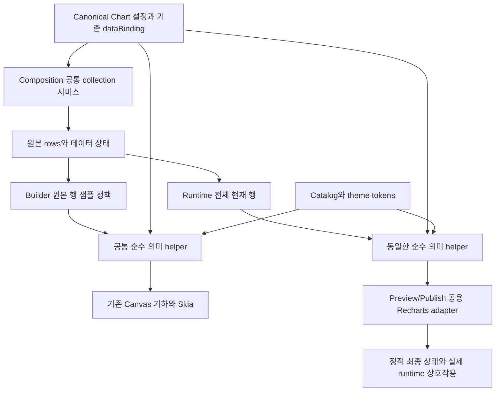

# ADR-209 구현 상세: 차트별 편집 경험과 Canvas·Recharts 런타임 분리

> 정본 결정: [ADR-209](../209-chart-authoring-canvas-recharts-runtime.md). 상태 **In Progress**, 2026-09-09. P0~P4 구현·검증 후 P5 종결 조건 확인 중. 아래 경로 inventory와 `(신규 제안)` 표시는 설계 작성 당시 기준이며, 실제 구현·검증 현황은 [실행 근거](../evidence/209-execution-live.md)를 따른다. 설계 조사 기준 HEAD `f2779b7d2`, 실행 baseline `31dff0c50`. 기존 readiness 작업의 goal/guard/stop은 보존한다.

## 1. 사용자 요구와 전제

| 대화에서 확정한 요구                           | 설계 반영                                                                        |
| ---------------------------------------------- | -------------------------------------------------------------------------------- |
| Collections의 Chart 한 개가 불편함             | Charts 섹션, Area·Bar·Line·Pie·Radar·Radial 6개 생성 항목                        |
| 차트별 컴포넌트와 적합한 Properties            | 차트별 표시 정체성, 종류/설정에 따른 dynamic contract, 기본 Chart Type 선택 제거 |
| 스타일은 shadcn/ui, 차트 라이브러리는 Recharts | shadcn 시각 참조 → catalog 토큰, Preview/Publish 실제 Recharts                   |
| Builder는 Canvas, 실행은 RAC와 같은 역할 분리  | Canvas는 최종 정적 상태, runtime은 animation·tooltip·접근성                      |
| 다른 데이터 컴포넌트와 같은 collection 유지    | 기존 dataBinding와 React Stately/공통 서비스 경유, chart adapter만 추가          |
| 모든 내용을 설계서로 작성                      | ADR 본문+본 breakdown+README. 구현·설치·commit/push는 이번 요청에 포함하지 않음  |

### 1.1 분리 전제 4항목

1. **base/응용**: ADR-194의 Chart 데이터/Canvas 기반 위에서 저작 UX와 DOM runtime 결정을 부분 교체한다. 새로운 데이터 플랫폼이나 역방향 prerequisite를 만들지 않는다.
2. **schema 관계**: 저장 타입은 기존 Chart이고 `chartType`으로 specialization한다. palette 생성 ID는 저장 타입과 직교한다. optional animation 속성은 가산적이다.
3. **선행 전제 재검증**: ADR-194 대안 C의 hidden SVG 해석기와 독립 Canvas/Recharts는 다르다. ADR-207의 분리=복제 전제도 자동 승계하지 않는다. 코드 근거는 §2와 ADR 본문에 있다.
4. **확정 시점**: 사용자가 본 대화에서 Canvas/Recharts 역할 분리와 collection 유지 방향을 추가한 뒤 “모든 수정사항을 반영한 설계서를 작성해”라고 요청했다. 이를 **설계 작성 범위의 승인**으로 읽으며, 반복 확인이나 구현 승인으로 해석하지 않는다. 파일명·생성 ID·초기 프리셋·예산은 이 문서가 제안하는 구체화다.

### 1.2 성공하는 사용자 흐름

Components의 Charts를 열어 Area Chart를 추가하면 즉시 Area가 보인다. Properties에서 기존 DataTable을 선택하고 범주/수치/시리즈 컬럼을 지정한다. Stacked 프리셋을 적용하고 범례·레이블·애니메이션을 설정한다. Canvas는 정적 완성 상태를 갱신한다. Preview에서 실제 Recharts의 animation·tooltip을 확인하고 Publish에서도 같은 설정이 실행된다. 문서를 다시 열면 종류·바인딩·설정이 유지된다.

## 2. 현재 코드와 변경 경계

| 현재 파일·심볼                                                                      | 확인한 사실                                                                             | 예정 변경/검증                                                                                                                             |
| ----------------------------------------------------------------------------------- | --------------------------------------------------------------------------------------- | ------------------------------------------------------------------------------------------------------------------------------------------ |
| `packages/shared/src/catalog/componentCatalog.ts:450`                               | Chart primitive, category=collections                                                   | Charts meta + 6개 생성 항목의 catalog 연결                                                                                                 |
| `packages/shared/src/catalog/types.ts:223` `PanelMeta`                              | panel meta는 단일 label/icon/placeable                                                  | 최소한의 생성 variant metadata 확장, primitive 6개 복제 금지                                                                               |
| `apps/builder/src/builder/panels/components/paletteItems.ts:243,274`                | type=Chart 1행, type로 meta 파생                                                        | palette ID와 componentType 분리, oracle 갱신                                                                                               |
| `ComponentList.tsx:30,69,117` (동일 디렉터리)                                       | 추가 인자·React key·검색/최근 기록이 type 기준                                          | 6종 생성 요청 전달, 검색/최근/즐겨찾기 key의 의미 구분                                                                                     |
| `apps/builder/src/builder/hooks/useRecentComponents.ts`, `useFavoriteComponents.ts` | type 기반 localStorage/React Stately 목록                                               | 생성 ID 기록 및 기존 Chart ID 호환                                                                                                         |
| `apps/builder/src/builder/factories/definitions/DisplayComponents.ts:551`           | createChartDefinition, 기본 bar와 샘플을 직접 씀                                        | 공통 chart 생성 descriptor를 factory에서 소비                                                                                              |
| `apps/builder/src/types/builder/unified.types.ts:2199`                              | createDefaultChartProps에 기본값/샘플 중복                                              | 같은 descriptor 소비, generic Chart의 legacy default 유지                                                                                  |
| `packages/shared/src/catalog/bindings/Chart.binding.ts:41,120,299`                  | chartType enum·조건부 옵션, Legend Position은 무조건 노출                               | 종류 판정은 유지, UI만 숨김, animation/종속 조건 추가                                                                                      |
| `packages/shared/src/catalog/resolvers/resolveEditContract.ts`                      | contract → ResolvedField 경로                                                           | 숨김 metadata 운반, resolved value를 조건 입력에서 보존                                                                                    |
| `apps/builder/src/builder/panels/properties/generic/GenericFieldRenderer.tsx:350`   | 넘어온 fields의 currentValue만 조건 입력으로 사용                                       | chartType 제거 후 필터하는 결함 방지                                                                                                       |
| `packages/specs/src/chart/series.ts:45` `buildSeriesGrid`                           | 범주×시리즈 중복 합산, 순서·결측 보존                                                   | 공통 의미 모델에 재사용, 양쪽 중복 집계 금지                                                                                               |
| `packages/specs/src/chart/types.ts`, `computeChartScene.ts:53,65`                   | 6종 기하·기본값, CHART_SAMPLE_ROWS=200                                                  | 순수 의미 계약과 Canvas 기하 구분                                                                                                          |
| `packages/shared/src/components/Chart.tsx:398-414`                                  | 공통 훅 → 빈 결과 샘플 fallback → 200행 slice → 자체 SVG                                | 데이터 container/lazy runtime 분리, runtime 절삭 제거                                                                                      |
| `packages/shared/src/components/Chart.tsx:470-479`                                  | wrapper 가 `react-aria-Chart` base class 와 `data-variant`/`data-size` 를 **직접 합성** | lazy container 재구조화 후에도 같은 wrapper 가 합성. ADR-194:180 ② 는 이 누락으로 생성 CSS 가 Preview 차트에 전량 미적용된 실제 결함 (R11) |
| `packages/shared/src/hooks/useCollectionData.tsx:220,322`                           | useAsyncList + DI, 기존 source별 로딩·캐시·정렬·필터                                    | 동일 경로 재사용, 공급 실배선 조사                                                                                                         |
| `packages/shared/src/collections/resolveCollectionItems.ts:211`                     | Canvas readDataBindingRows가 snapshot 조회                                              | 유지. Canvas draw에서 fetch/React 훅 금지                                                                                                  |
| `apps/builder/src/builder/workspace/canvas/scene/canvasSceneNode.ts:2569`           | Chart leaf에 `_chartRows` 샘플 주입                                                     | 행 정책/상태 전달 확인, generic Chart type dispatch 유지                                                                                   |
| `packages/specs/src/renderers/skiaPrimitives.ts:3318`                               | chartScene → Canvas shape                                                               | Canvas consumer 유지, 새 style이면 동일 토큰 입력 확장                                                                                     |
| `apps/builder/src/preview/components/CanonicalNodeRenderer.tsx`                     | internal renderer 경로·staticAttrs 전달                                                 | Recharts 진입점·ARIA wrapper 확인                                                                                                          |
| `packages/shared/src/renderers/DataRenderers.tsx:41`                                | props를 수동 열거해 shared Chart 호출                                                   | 신규 animation 포함 누락 없이 같은 adapter 도달                                                                                            |
| `apps/publish/src/registry/ComponentRegistry.tsx:406`                               | shared Chart 등록                                                                       | 독립 Publish 진입도 동일 runtime                                                                                                           |

경로·라인은 작성 시점 탐색 근거이며 구현 때 이동 여부를 확인한다. 후보 파일 수는 확정 견적이 아니다. P0에서 실제 import/caller/factory/저장·reload 경계를 따라 inventory를 고정한다.

**공통 데이터 선행 결손**: 작성 시 `CollectionDataProvider`/`CollectionDataContext`의 앱 장착 경로가 검색되지 않았다. provider 정의가 존재한다는 사실로 공급 완료를 선언하지 않는다. ADR-152의 기존 상태를 확인하고, 공통 Preview/Publish 서비스 연결을 G3의 선행 작업으로 명시한다. 이를 차트 안의 API 호출로 대체하지 않는다. 공통 인프라 변경이 필요하면 기존 collection 소비자에 대한 회귀 검증까지 포함해 범위를 구체화하며, 데이터 플랫폼 전체 재설계는 이 ADR에 넣지 않는다.

## 3. 사용자 경험과 저장 계약

### 3.1 6개 생성 항목, 1개 저장 코어

| paletteId (제안) | 표시 이름    | 저장 Chart 설정       | Recharts 실행 조합         |
| ---------------- | ------------ | --------------------- | -------------------------- |
| `chart-area`     | Area Chart   | `chartType: "area"`   | AreaChart + Area           |
| `chart-bar`      | Bar Chart    | `chartType: "bar"`    | BarChart + Bar             |
| `chart-line`     | Line Chart   | `chartType: "line"`   | LineChart + Line           |
| `chart-pie`      | Pie Chart    | `chartType: "pie"`    | PieChart + Pie             |
| `chart-radar`    | Radar Chart  | `chartType: "radar"`  | RadarChart + Radar         |
| `chart-radial`   | Radial Chart | `chartType: "radial"` | RadialBarChart + RadialBar |

- catalog의 Chart primitive를 6건 복제하지 않는다. `paletteId`는 검색·최근·즐겨찾기에 쓰는 생성 식별자다. `componentType:"Chart"`와 생성 props를 별도로 전달한다. 일반 컴포넌트는 기존 type를 기본 palette ID로 사용한다.
- Charts는 Collections 다음 독립 section이며 일괄 펼침/접힘·검색·다국어 검색에 포함한다. 기존 Collections의 Chart 행은 제거한다.
- 최근/즐겨찾기의 기존 `Chart` 기록은 `chart-bar`로 해석한다. 동시 존재하면 최근 항목은 count를 합치고 최신 순서를 보존하며, 즐겨찾기는 한 항목으로 합친다. 기존 localStorage 전체를 초기화하지 않는다.
- 추가는 기존 factory → canonical mutation → persistence 경로에서 **한 번에** Chart와 초기 props를 만든다. bar를 먼저 저장한 뒤 chartType을 바꾸는 2단계 생성은 피한다. Undo 한 번으로 생성 전체가 되돌아가야 한다.
- Navigator/Properties 기본 표시 이름은 effective chartType에서 파생한다. 사용자가 지정한 이름은 보존한다. 파생 이름만을 위해 node 이름을 매번 저장하지 않는다.
- command/agent/import 등 `Chart`를 직접 만드는 기존 진입은 default bar를 유지한다. 새 paletteId를 canonical type 또는 명령 컴포넌트 타입으로 오인하지 않도록 registration oracle을 생성 항목/저장 타입별로 검사한다.

### 3.2 프리셋과 옵션

초기 preset은 **현재 지원되는 표현으로 시작**한다. shadcn 전체 예제를 완료했다고 주장하지 않는다. 아래 프리셋마다 적용 patch의 키와 값을 registry에 명시하고 두 renderer가 같은 값을 받는다.

| 종류   | 초기 프리셋 범위                             | 주요 전용 옵션                                          |
| ------ | -------------------------------------------- | ------------------------------------------------------- |
| Area   | Default, Linear, Step, Stacked, Stacked 100% | 곡선·누적·점·방향                                       |
| Bar    | Default, Horizontal, Stacked, Stacked 100%   | 방향·누적·색 구분                                       |
| Line   | Default, Linear, Step, Dots                  | 곡선·점·방향·기존 누적 옵션                             |
| Pie    | Default, Donut, Donut Total                  | innerRadius·합계·기존 다중 시리즈 링 의미               |
| Radar  | Polygon, Circle, Lines Only                  | 격자 형태·스포크·링 수·격자 채움·면 채움·점·innerRadius |
| Radial | Default, Stacked, Half, Total                | 시작/종료 각도·innerRadius·누적·합계                    |

프리셋은 스타일/종류별 설정의 **명시적 patch**다. 데이터 소스·컬럼 매핑·실제 rows·사용자 이름·레이아웃 크기·animation을 임의로 덮어쓰지 않는다. 설정값을 canonical에 materialize하고, 프리셋 ID를 해석해야만 그림이 재현되는 저장 계약은 만들지 않는다. 현재 값과 정확히 일치하면 프리셋 이름, 아니면 Custom으로 표시한다. preset을 바꾸면 이전 preset 전용 키를 포함한 해당 preset의 소유 키 집합을 명시적으로 reset한다. Undo/Redo 한 번의 의미 mutation으로 처리한다.

**기존 저장 문서의 미지정 prop 기본값과 신규 생성 기본값을 분리**한다. 아래는 신규 생성/프리셋용 제안이며 기존 문서를 읽을 때 소급 적용하지 않는다. 공통 신규값은 `showLegend=true`, `showTooltip=true`, `showValueLabels=false`, `legendPosition=bottom`이고 animation은 §3.4를 따른다. 나머지 기존 prop은 legacy resolver 기본값에서 시작한 뒤 아래 값을 명시한다.

| 종류   | 신규 Default와 reset 기준                                                                                                                  | 이름 있는 프리셋의 추가 patch                                                                      |
| ------ | ------------------------------------------------------------------------------------------------------------------------------------------ | -------------------------------------------------------------------------------------------------- |
| Area   | orientation=vertical, curve=monotone, stackType=dodged, showAxis=true, showGrid=true, showDots=false                                       | Linear: curve=linear; Step: curve=step; Stacked: stackType=stacked; Stacked 100%: stackType=expand |
| Bar    | orientation=vertical, stackType=dodged, colorBy=series, showAxis=true, showGrid=true                                                       | Horizontal: orientation=horizontal; Stacked: stackType=stacked; Stacked 100%: stackType=expand     |
| Line   | orientation=vertical, curve=monotone, stackType=dodged, showAxis=true, showGrid=true, showDots=false                                       | Linear: curve=linear; Step: curve=step; Dots: showDots=true                                        |
| Pie    | innerRadius=0, stackType=dodged, showTotal=false, showAxis=false, showGrid=false                                                           | Donut: innerRadius=60; Donut Total: innerRadius=60, showTotal=true                                 |
| Radar  | gridType=polygon, showAxis=true, showGrid=true, showSpokes=true, gridRings=0, fillGrid=false, fillArea=true, showDots=false, innerRadius=0 | Polygon: Default; Circle: gridType=circle; Lines Only: fillArea=false                              |
| Radial | startAngle=0, endAngle=360, innerRadius=20, stackType=dodged, showTotal=false, showAxis=false, showGrid=false                              | Stacked: stackType=stacked; Half: endAngle=180; Total: showTotal=true                              |

프리셋의 유효 patch는 **해당 종류 Default의 시각 키 + 추가 patch**다. 공통 신규값 중 tooltip/animation, 데이터, 크기는 preset reset 소유 키에서 제외한다. 따라서 Dots→Default는 showDots=false로 돌아오지만 사용자가 고른 source나 animation은 보존된다. 동일 patch의 Radar Default/Polygon은 선택지에서 Polygon 한 개로 노출한다.

새 palette 샘플은 원본 `{category,value,series}` 형식을 공유하되 종류가 식별되도록 4~6개 범주와 양수 유한 값을 사용한다. Cartesian/Radar는 2시리즈, Pie/Radial은 1시리즈 기본 샘플로 시작하고 여러 시리즈는 사용자 데이터로 지원한다. fixture의 실제 수치는 P0에서 고정한다. 모든 생성 경로는 같은 descriptor를 소비한다.

Gradient는 레퍼런스에 있지만 초기 필수 preset 목록에는 넣지 않는다. Canvas/DOM 공통 paint 경로 확인 후 두 소비자·토큰·게이트를 함께 추가하는 후속 후보로 기록한다. 임의 커스텀 JSX, legend icon ReactNode, 복합 차트, brush·streaming도 같은 방식으로 후속 범위를 구분한다.

### 3.3 동적 Properties

- **Data**: 기존 dataBinding 컨트롤 + schema 기반 범주(`dimension`)·수치(`metric`)·시리즈(`color`) 선택. schema가 없는 정적 데이터도 기존 임의 필드명 입력을 지원한다. 빈 source를 연결했을 때 샘플 rows 편집을 실제 source 편집처럼 표시하지 않는다.
- **Appearance**: preset·공통 범례/레이블·종류별 유효 옵션. `legendPosition`은 `showLegend=true`일 때만, `labelKey`는 `showValueLabels=true`일 때만 표시한다. 격자 하위 옵션도 상위 토글과 실제 소비가 함께 성립할 때 표시한다.
- **Interaction**: tooltip과 animation. runtime에서만 동작하는 항목은 “미리보기에서 확인”으로 짧게 안내한다. Canvas에서 정적 변화가 없다는 이유로 유효한 실행 옵션을 숨기지 않는다.
- **일반 Chart Type select 제거**: `chartType` 자체는 accepts/기본값/직렬화/조건 입력에 남긴다. `PropContract`/`ResolvedField`에 최소한의 editor 숨김 metadata가 필요하다면 가산적으로 도입하고, `GenericFieldRenderer`는 **조건 입력 전체 생성 → editor 숨김 및 visibleWhen 평가** 순서로 처리한다. 차트 필드를 먼저 제외해 조건 입력을 잃지 않는다.
- `visibleWhen`은 현재 단일 key 조건이다. 여러 토글의 AND가 필요한 필드만 최소 표현을 확장하며 evaluator/ResolvedField 운반/기존 Card 조건 회귀를 함께 검증한다. 종류별 React 폼 6개를 수작업으로 만들지 않는다.
- 일반 패널 밖의 **차트 종류 변경** 동작은 제공한다. 데이터를 유지하고 chartType만 한 번에 변경하며 숨겨진 종류별 값은 ADR-208처럼 보존한다. 새 종류 preset을 자동 적용하지 않는다. 종류를 왕복하면 이전 값이 돌아오고, 의도적으로 초기화하려면 preset을 선택한다.
- 정적 옵션의 유효성은 Canvas와 Recharts 양쪽 출력 변화로 검사한다. animation/tooltip은 runtime 동작으로 검사한다. 기존 차등 오라클을 `scene 변화 없음 = 필드 불필요`로 일괄 적용하지 않는다.

### 3.4 animation 저장 계약

공개 API 명칭을 참조한 optional props를 제안한다: `isAnimationActive`, `animationBegin`, `animationDuration`, `animationEasing`. 시간 단위는 ms, begin/duration은 유한한 0 이상 숫자, easing 초기 지원은 linear/ease/ease-in/ease-out/ease-in-out이다. 함수 easing과 임의 실행 코드는 저장하지 않는다.

- 기존 문서 미지정: animation off. 신규 palette 생성: on, begin=0, duration=600, easing=ease-out을 **제안 기본값**으로 명시 저장한다. 이는 Recharts의 현재 기본 duration 1500ms를 그대로 채택한 값이 아니다.
- off일 때 timing 필드를 숨기지만 값은 보존한다. OS `prefers-reduced-motion: reduce`이면 저장 설정과 무관하게 실행을 끈다. 저장값을 변경하지 않는다.
- Canvas는 최종 상태만 그린다. Preview/Publish는 mount 및 유효 데이터 변경에 실행한다. 무관한 selection/props 객체 생성 때문에 매번 재생하지 않도록 stable key/data identity를 유지한다.
- hover, activeIndex, animation progress, runtime focus는 canonical·DB로 쓰지 않는다. runtime 사용자 상호작용을 Builder 선택 상태와 결합하지 않는다.

## 4. 공통 데이터와 두 렌더러

### 4.1 데이터 계약

샘플링은 **의미 집계 전에 원본 행에 적용**한다. Builder에서 전체 수천 행을 먼저 집계한 뒤 시리즈 200개를 고르는 것으로 바꾸지 않는다. 같은 helper라도 환경별 행 정책이 다르므로 실제 입력 행 집합과 source revision을 함께 기록한다.

1. **원본 공급**: DataTable/API/static의 기존 binding 형식·서비스·캐시·취소·필터/정렬 결과를 재사용한다. Chart별 fetch·정렬 저장소·새 provider를 만들지 않는다. 공통 provider가 필요하면 앱 runtime 단위로 장착해 다른 데이터 컴포넌트도 같은 인스턴스를 소비한다.
2. **행 shape**: `useResolvedCollectionItems`의 label/value projection으로 축소하지 않는다. 원본 레코드에서 dimension/metric/color를 읽는다. RAC item 키나 selection은 chart 시리즈 모델로 자동 승계하지 않는다.
3. **의미 변환**: 현재 `buildSeriesGrid`의 최초 등장 순서, 범주×시리즈 중복 합산, 숫자 coercion 및 결측 보존 규약을 재사용한다. Recharts용 wide rows를 만들 때 원본 필드명을 내부 key로 그대로 조합하지 않고 충돌 없는 시리즈 ID를 사용한다. tooltip/legend에는 원본 label을 매핑한다. missing을 0으로 바꾸거나 중복 합산을 두 번 하지 않는다.
4. **갱신**: source revision/유효 rows가 달라질 때 같은 의미 변환을 다시 적용한다. key는 가능한 source id와 범주/시리즈의 안정 식별자에서 파생한다. 동일 데이터를 새 배열로 감싼 것만으로 animation을 재시작하지 않는다.
5. **원본 보존**: 변환은 순수 read-time 결과다. DataTable rows와 canonical `dataBinding`을 수정하지 않는다. 여러 차트·Table/List가 한 source를 공유할 수 있다.

### 4.2 데이터 상태·샘플·행 수

| 상태/환경                    | 목표 동작                                                                                                                        |
| ---------------------------- | -------------------------------------------------------------------------------------------------------------------------------- |
| dataBinding 없음             | 저장된 정적 `data`/신규 생성 샘플 사용                                                                                           |
| 명시적 mock 사용             | 공통 collection 서비스가 선택한 mock을 그대로 사용                                                                               |
| 바인딩 로딩/오류             | 공통 상태 표현, Chart가 자체 샘플로 성공 표시하지 않음                                                                           |
| 서비스가 성공한 빈 결과 반환 | 빈 차트 상태. props.data 샘플로 재대체하지 않음                                                                                  |
| Builder Canvas               | 현재 200행 샘플 정책 유지, 일부 데이터라는 저작 표시와 입력 행 수 기록. 저장 원본은 절삭하지 않음                                |
| Preview/Publish              | 서비스가 제공한 전체 현재 결과를 사용. Chart 내부의 200행 slice 제거. 서버 pagination의 모든 페이지를 자동 fetch한다는 뜻은 아님 |

현재 공통 `readDataBindingRows`와 `useCollectionData`에도 runtime rows가 비면 mockData를 고르는 규칙이 있다. **공통 서비스의 mock 정책과 Chart의 추가 props.data fallback을 구분**한다. 이 ADR은 공통 정책을 차트만 다르게 재정의하지 않는다. 성공한 빈 결과와 미로딩을 구분할 서비스 정보가 부족하면 그 공통 계약 결손을 G3 선행 수리로 기록한다. 샘플 데이터 성공으로 실데이터 연결을 통과시키지 않는다.

Canvas 샘플과 runtime 전체 결과는 200행 초과에서 합계·범위가 달라질 수 있다. 이 차이는 명시적 샘플 정책이며 수치 동일성으로 속이지 않는다. 정합 게이트에는 같은 rows를 양쪽에 제공하고, 별도로 201행/5000행 runtime에서 후반 데이터가 누락되지 않는지 확인한다. downsampling을 추가하려면 별도 계약이 필요하다.

### 4.3 의미 모델과 Recharts 매핑

`packages/specs/src/chart/`에 React/Recharts 의존 없는 설정 해소·데이터 의미 helper를 둔다. 현재 `computeChartScene`은 Canvas 기하 consumer로 남는다. 공통 의미 모델은 범주·시리즈·값·정렬·도메인·tick 정책·레이블 형식·토큰 역할을 포함하고, Recharts를 대신해 모든 SVG path를 그리는 모델로 만들지 않는다.

`packages/shared/src/components/chart/RechartsChart.tsx` **(신규 제안)**가 실제 Recharts Chart/mark 컴포넌트를 조합한다. `Chart.tsx`는 공통 데이터 container와 lazy 경계 역할을 한다. Preview internal renderer·DataRenderers·Publish registry 모두 이 진입점으로 수렴한다. 실제 소비자를 확인한 후에만 기존 자체 SVG runtime을 제거하며 Canvas helper는 유지한다.

| 계약 축                 | 변환/호환 규칙                                                                                                                                                                                                                                                                                                                                                                                                                                                                                                                                                                                                                                                        |
| ----------------------- | --------------------------------------------------------------------------------------------------------------------------------------------------------------------------------------------------------------------------------------------------------------------------------------------------------------------------------------------------------------------------------------------------------------------------------------------------------------------------------------------------------------------------------------------------------------------------------------------------------------------------------------------------------------------- |
| **곡선 보간 (제어점)**  | `curves.ts:4-8` 은 ADR-194 가 "곡선을 각자 그리면 그 순간 발산한다" 며 제거한 발산원이다. `curves.ts:89-122` 는 Fritsch–Carlson 접선을 **along/across 축 좌표계**에서 계산한 뒤 화면으로 옮기고, Recharts `monotone`은 layout에 따라 X/Y를 선택한다. 올바른 방향 매핑 후에도 Canvas의 접선/끝점 계산과 d3 Steffen 알고리즘 차이가 남는다 (Round 2의 3점 fixture: 두 방향 중간점 6.25125px 차이). step 의 중점 규약, area baseline, pie/radial arc 세그먼트도 같은 축이다. 앵커(데이터 점)는 양쪽이 구조적으로 일치하므로 **앵커 일치를 보간 일치의 근거로 쓰지 않는다.** 공개 API 로 같은 보간을 못 내면 G0 실패 — Canvas 곡선을 Recharts 쪽으로 조용히 바꾸지 않는다 |
| Cartesian 방향          | Composition vertical/horizontal과 Recharts parent layout의 대응을 명시. 문자열을 그대로 넘기지 않음                                                                                                                                                                                                                                                                                                                                                                                                                                                                                                                                                                   |
| Axis domain/ticks       | 0 포함·음수·nice tick·label stride를 명시 입력으로 고정. 양쪽 auto 계산의 우연한 일치에 의존하지 않음                                                                                                                                                                                                                                                                                                                                                                                                                                                                                                                                                                 |
| Plot 크기               | 외곽 크기·font readiness·margin·legend 공간을 명시. Recharts 측정 결과를 Canvas로 가져오지 않음                                                                                                                                                                                                                                                                                                                                                                                                                                                                                                                                                                       |
| Stack/expand            | 기존 percent 단위 0~~100 유지. Recharts normalize 결과가 0~~1이면 adapter가 명시 변환. 전처리와 stackOffset의 이중 정규화 금지                                                                                                                                                                                                                                                                                                                                                                                                                                                                                                                                        |
| Duplicate/null/negative | 기존 합산·끊김·pie 절댓값·polar 음수 clamp·radar 결측 접힘을 대응 fixture로 고정                                                                                                                                                                                                                                                                                                                                                                                                                                                                                                                                                                                      |
| Polar 각도              | canonical은 12시=0, 시계 방향 유지. Recharts 공개 API의 각도 convention에 맞춰 adapter에서 변환하고 0/90/180/360 위치를 테스트                                                                                                                                                                                                                                                                                                                                                                                                                                                                                                                                        |
| Pie/radial 다중 series  | 기존 링 분할·누적 의미를 보존. 공개 조합으로 재현 가능한지를 G0에서 먼저 검사                                                                                                                                                                                                                                                                                                                                                                                                                                                                                                                                                                                         |
| Color/legend/labels     | catalog 시리즈 순서·범주 색 모드·포맷·합계를 같은 규칙으로 해소. 여러 차트의 SVG defs ID 충돌 방지                                                                                                                                                                                                                                                                                                                                                                                                                                                                                                                                                                    |
| Animation/tooltip       | Recharts가 실제로 실행. tooltip 값은 runtime local payload/원본 label로 구성, 저장 모델에 ReactNode/function 불허                                                                                                                                                                                                                                                                                                                                                                                                                                                                                                                                                     |

`stackType`은 line/pie도 현재 소비하고, `innerRadius`는 radar도 소비한다. 통상적인 차트 API 상식으로 기존 항목을 제거하지 않는다. 공개 API로 기존 표현을 구현할 수 없으면 기존 document 의미를 바꾸거나 Recharts 내부 state/DOM에 접근하는 대신 G0를 실패시킨다.

### 4.4 스타일·접근성·로딩 경계

- shadcn 스타일은 축/격자/시리즈/범례/tooltip/타이포그래피 참조로 사용한다. 예제의 Card 제목·설명·footer를 Chart leaf에 자동 삽입하지 않는다. 사용자가 필요하면 기존 Card/Text와 조합한다.
- 기존 chart CSS 변수와 catalog rule을 Recharts props에 연결한다. shadcn `--chart-1` 같은 이름이 필요하면 기존 token의 adapter alias로 제한한다. 별도 raw hex 팔레트는 만들지 않는다.
- chart host에는 실제 레이아웃 크기가 필요하다. 부모 크기 변경은 ResizeObserver/명시 size 경로로 처리하고 hidden/0 크기 때 가짜 크기로 완성 표시하지 않는다. suspense/loading/error shell은 예약된 box를 유지한다.
- Recharts import는 lazy runtime 모듈에만 둔다. shared root barrel에 정적 export를 추가해 Builder 초기 그래프에 유입시키지 않는다. 동일 문서의 여러 Chart가 같은 chunk를 공유한다. unmount 중 로드 완료가 stale node 상태를 쓰지 않는다.
- `Chart.tsx:470-479` 의 wrapper 가 `react-aria-Chart` base class 와 `data-variant`/`data-size` 를 직접 합성한다 — generate-css 가 `.react-aria-Chart` 에 emit 하므로 이 합성이 빠지면 배경·테두리·팔레트 변수가 DOM 에 닿지 않는다. ADR-194:180 ② 가 실제로 낸 결함이고, lazy container 로 나눌 때 wrapper 를 어느 쪽이 소유하는지가 그 재발 지점이다 (R11). `RechartsChart.tsx` 안쪽이 아니라 **container wrapper 가 계속 합성**하고, G4 에서 Preview/Publish DOM wrapper의 class·data-attr를 검사하고 Canvas와 토큰 해소값·그림을 대조한다.
- **의존 금지 규칙 갱신**: `.claude/skills/component-design/SKILL.md:86` 은 상시 로드되는 코드 작업 규칙이라 "외부 라이브러리 추가 설치 금지" 가 그대로 남으면 결정과 문서가 갈린다. HC7 의 범위 예외 문장(차트 runtime 한정·lazy 경계 뒤·초기 번들 제약 유지)을 그 항목에 반영하는 것을 **P5 산출물과 G6 통과 조건**에 포함한다.
- 기존 Chart binding의 `staticAttrs.role=img`가 interactive Recharts와 충돌하는지 실제 accessibility tree에서 확인한다. 차트 wrapper의 접근 가능한 이름은 유지하고, keyboard/tooltip·실제 지원되는 계열별 semantics를 검증한다. 라이브러리 사용만으로 접근성 완료를 선언하지 않는다.
- Recharts 버전은 P0에서 React 19 호환·공개 API·MIT 고지·전이 의존·번들을 확인해 lockfile에 고정한다. 문서 작성 단계에는 설치하지 않는다. 채택 시 새 의존 예외는 차트 runtime에만 적용한다.

## 5. 실행 단계

2026-09-09 사용자가 **P0~P5 전체 실행을 승인**했다. 구현·검증 완료 여부는 각 단계 증거로 기록한다. 사용자가 실행을 승인한 뒤에는 이미 승인된 범위의 단계마다 재승인을 요구하지 않는다.

| 단계                                | 책임 범위                                                                                                                                                              | 완료 조건/산출물                                                                                                   |
| ----------------------------------- | ---------------------------------------------------------------------------------------------------------------------------------------------------------------------- | ------------------------------------------------------------------------------------------------------------------ |
| P0 사실 고정·first nail             | 실제 추가/저장/로드/import 경로, Recharts 공개 API 후보, shared provider 소비 경로와 ADR-152 선행 항목. 실제 Recharts와 6종 spike, **곡선 보간 축 반증 1케이스 (R10)** | G0, baseline HEAD·버전·원본 데이터·오차(앵커·구간 중간점 분리 기록)/불가능 옵션·chunk 보고서. 전체 UI 전환 전 판단 |
| P1 공통 차트 계약                   | 생성 descriptor/defaults·순수 rows/series 의미·토큰/단위 매핑·animation schema                                                                                         | G1, 기준 fixture와 양쪽 adapter 입력 정의                                                                          |
| P2 Charts/Properties                | catalog palette variants·고유 ID·factory initial props·최근/즐겨찾기/검색·동적 필드·preset patch·파생 이름                                                             | G2, 실제 6종 추가·편집·Undo·reload                                                                                 |
| P3 실제 Recharts와 공통 데이터 결선 | lazy runtime, internal/legacy/Publish 진입, provider 선행 결손 수리 또는 완료 근거, 전체 현재 rows·상태 처리                                                           | G3, 실제 source를 Table/List와 함께 쓰는 Preview·독립 Publish 증거                                                 |
| P4 시각/상호작용 정합               | Canvas와 Recharts 설정 대응·초기 preset·light/dark/resize·animation/tooltip/ARIA                                                                                       | G4. unsupported 옵션을 숨겨 legacy 회귀를 통과시키지 않음                                                          |
| P5 전환/성능/종결                   | 번들·실행 A/B, 기존 자체 SVG runtime의 실제 소비 종료 확인, 호환성/rollback, 문서 동기화 (`SKILL.md:86` 의존 금지 항목 갱신 포함)                                      | G5/G6. 선행 ADR 부분 대체 주석·CHANGELOG·README 상태·실제 Live Exercise                                            |

공통 데이터 결선이 차트 외부에 영향을 주면 P3 inventory에 기존 소비자와 변경 파일을 포함한다. scope가 데이터 플랫폼 재설계로 커지면 별도 문제로 보고하며 차트 안의 임시 fetch로 진행하지 않는다. P0가 실패하면 P2~P5 완료 주장을 하지 않는다.

### 5.1 최소 변경 파일 묶음

현재 파일은 §2를 따른다. 신규 제안은 다음 책임으로만 제한한다.

- `packages/specs/src/chart/`의 descriptor/의미 helper: 6벌 defaults/series 처리 복제 방지. Recharts import 금지.
- shared catalog의 Chart palette metadata + binding: 등록과 Properties 근거. palette oracle 및 registration 계약도 생성 ID/저장 type을 구분.
- shared chart runtime adapter: 공용 DOM runtime 한 개. 6종 JSX 조합은 이 경계 내부의 타입 분기로 표현.
- 기존 Builder 추가 action/팩토리와 선택 이름 helper: 초기 props 전달·한 번의 canonical mutation·표시 이름 파생.
- shared chart wrapper 소유 경계: `react-aria-Chart` base class + `data-variant`/`data-size` 합성은 lazy container 쪽에 남긴다 (R11 — runtime 모듈로 내리지 않는다).
- 기존 common collection DI/preview transport: 실제 미배선이 확인된 최소 경계. 차트 전용 인프라 금지.
- 테스트는 각 변경 모듈 인접 focused test와 실제 브라우저 exercise. 기존 DOM/Skia path byte 비교 테스트의 재사용 가능 항목과 교체할 항목을 분리 기록.

## 6. 검증과 측정

### 6.1 Gate oracle

| Gate/검사      | 표본과 조작                                                                                                                                                                        | 통과 근거                                                                                                                                                                                                                                                                                                                                                                                |
| -------------- | ---------------------------------------------------------------------------------------------------------------------------------------------------------------------------------- | ---------------------------------------------------------------------------------------------------------------------------------------------------------------------------------------------------------------------------------------------------------------------------------------------------------------------------------------------------------------------------------------- |
| G0 first nail  | 정적 데이터로 6종 기본형, area 100%, pie 다중 링, radar null+innerRadius, radial 각도+누적                                                                                         | 실제 pinned Recharts SVG/브라우저 좌표 vs Canvas 기하·픽셀. 라이브러리 stub이나 자체 SVG 두 개 비교 금지. **R10 first nail** — `curve=monotone` × `orientation=horizontal` 라인 1개에서 앵커가 아닌 **구간 중간점(t=0.5)** 좌표를 양쪽에서 뽑아 대조한다 (앵커만 맞고 사이가 갈리는 형태를 여기서 잡는다)                                                                                |
| G1 데이터 의미 | 손계산 가능한 중복 합산·0·음수·null·문자 수치·빈 범주·같은 label·다중 series                                                                                                       | 예상 합계/결측/순서와 양쪽 adapter 값 일치. 시스템 출력으로 expected 재생성 금지                                                                                                                                                                                                                                                                                                         |
| G2 편집        | 실제 Charts 6개 클릭 추가, Recent/Favorite, 검색, 종류 변경 왕복, preset Custom 판정, ref override, Undo/Redo                                                                      | 생성 직후 저장 chartType, 패널 이름/필드, 재열기 후 상태. Chart Type 미저장도 bar 필드 유지                                                                                                                                                                                                                                                                                              |
| G3 공급        | 같은 source를 Chart와 Table 또는 List가 소비, API 지연/오류/취소·DataTable 갱신·static·empty·mock                                                                                  | 네트워크/서비스 호출과 실제 값·row revision을 함께 기록. 차트 전용 중복 fetch 없음. Preview reload와 독립 Publish에서 각각 검증                                                                                                                                                                                                                                                          |
| G3 행 수       | 201번째 행에 눈에 띄는 값, 5000행 기능 표본                                                                                                                                        | runtime에서 후반 값·전체 합계 유지, Builder 200행 샘플 표기. 서버 페이지 자동 합산은 요구하지 않음                                                                                                                                                                                                                                                                                       |
| G4 정적 대칭   | 6종×초기 preset, 기본/비기본 옵션, light/dark, 320×240·640×360, DPR 1/2. **앵커 사이 기하** — curve 3종(monotone/linear/step) × orientation 2, area baseline, pie/donut/radial arc | 외곽/plot/핵심 mark 좌표 ≤1 CSS px, tick/legend/value 일치, token 해소값 일치. 픽셀 diff는 AA를 구분하고 마크 결손·clip은 허용하지 않음. 앵커 사이는 **구간 중간점 좌표 ≤1px 또는 곡선 영역 픽셀 diff 허용치**로 판정하고 앵커 일치만으로 통과시키지 않는다 (R10). Preview/Publish DOM wrapper의 base class·`data-variant`/`data-size`를 검사하고 Canvas와 토큰 해소값·그림을 대조 (R11) |
| G4 기존 문서   | 선행 ADR의 저장 문서+설정 누락 문서+다중 링/숨김 prop fixture                                                                                                                      | 이전 릴리스 그림과 의도된 데이터 행 정책 차이를 분리. 속성 누락·rename·default drift 0                                                                                                                                                                                                                                                                                                   |
| G4 animation   | enable/disable, delay/duration/easing, 데이터 교체, reduced-motion, 재mount                                                                                                        | 실제 중간 프레임 변화와 animation end를 관찰. 종료 후 Canvas와 비교, duration sleep만으로 PASS 금지                                                                                                                                                                                                                                                                                      |
| G4 interaction | tooltip show/hide·내용·keyboard, Preview 내 scrolling, 여러 차트                                                                                                                   | 실제 Recharts 동작·접근성 트리. runtime 동안 canonical write 0                                                                                                                                                                                                                                                                                                                           |
| G5 번들        | before/after 같은 production build·gzip 명령, dynamic transitive chunk graph                                                                                                       | 전체 초기 번들 <500KB와 공통 초기 순증 ≤10 KiB gzip을 별도로 기록하고 압축 여부·단위·대상 chunk를 명시. chart 그래프 순증 ≤200 KiB gzip. 차트 없는 페이지/편집 부트에서 chunk request 0                                                                                                                                                                                                  |
| G5 Builder     | 200행×4series 차트, 가시 populated 프로젝트에서 select/edit/zoom                                                                                                                   | 동일 머신의 before/after 최소 5쌍, frame 총비용 p95 Δ≤1ms. heap/visibility/DPR/build 기록                                                                                                                                                                                                                                                                                                |
| G5 runtime     | 200행×4series warm 데이터 교체·resize·animation on/off, 5000행 부하 별도                                                                                                           | 200행 입력→최종 정적 render p95 ≤100ms 제안 기준(지연/애니메이션 duration 제외해 별도 보고). frame/longtask·첫 chunk 로드 시간·heap 추세도 기록. 5000행은 규모 한계 보고용                                                                                                                                                                                                               |
| G6 종결        | 저장/reload/export/import/ref/Undo, 구 버전 rollback, production Publish                                                                                                           | 문서 강제 rewrite 0·필수 동작 보존, focused tests/cross-check/preflight·Live Exercise 증거. `.claude/skills/component-design/SKILL.md:86` 의존 금지 항목이 HC7 범위 예외를 반영                                                                                                                                                                                                          |

초기 preset 목록·노출 옵션 matrix를 production descriptor에서 열거하되 **기대 결과는 descriptor 자체로 만들지 않는다**. 실제 Recharts DOM, 손계산 데이터, 사용자 흐름을 독립 oracle로 사용한다. 기본형 byte snapshot은 Canvas 회귀용으로 유지할 수 있으나 새 runtime 정합의 충분조건은 아니다.

기존 `chartVisibleWhen.test.ts`의 Canvas 소비 검사는 정적 옵션에 유지한다. runtime 전용 옵션은 별도 runtime oracle이 맡는다. 조건·값·종속 토글 조합을 바꿨는데 실제 어느 소비자에서도 사용되지 않으면 패널 노출을 통과시키지 않는다.

### 6.2 측정 유효성 5질문

1. **출처**: 사람이 만든 Chart 포함 실제 프로젝트를 사용자 흐름 표본으로 쓰고, 200/5000행 합성 데이터는 규모·경계 검증에만 사용한다.
2. **불리 조건**: resize/zoom·data revision 교체·숨김 후 표시·light/dark·cold chunk·장문 tick·음수/결측을 포함한다.
3. **대조군**: Canvas 성능은 변경 전 같은 문서/같은 조작, runtime은 이전 자체 SVG와 새 Recharts animation off/on을 분리한다. 개선 수치 없이 기능 추가 비용만 보고해도 된다.
4. **소비 경로**: source→provider→실제 Chart caller→저장→reload→Publish까지 본다. 테스트 hook 직접 호출은 앱 연결 증거가 아니다.
5. **독립 oracle**: 실제 browser Recharts·손계산·사용자 조작을 사용한다. Canvas와 자체 SVG가 공통 기하를 읽어 같다는 기존 증거로 Recharts 정합을 주장하지 않는다.

조건 기록: commit/lockfile·OS/CPU·브라우저 버전·production/dev·viewport/DPR·font readiness·visible foreground 여부·warmup·샘플 수·대조군 drift. RAF timestamp cadence, callback gap, 프레임 내부 CPU, presentation drop을 혼용하지 않는다. 애니메이션 완료는 callback/실제 안정 결과로 확인하고 test timeout은 실패 처리한다.

### 6.3 작성 당시 검증과 현재 실행 상태

작성 시에는 문서 조사·검증만 수행했다. 이후 사용자가 전체 phase 실행을 승인하여 P0~~P4와 P5의 구현·측정·호환 검사를 진행했다. G0~~G4 PASS. G5의 전체 초기 번들 기준 결정과 로그인된 production Builder 부트 검증이 남으며, 선행 조건이 닫히기 전 G6 최종 전환을 완료로 선언하지 않는다. 수치와 원본은 [실행 근거](../evidence/209-execution-live.md) 및 `docs/adr/evidence/209-*`에 기록한다.

## 7. 호환성·롤백·후속 범위

- **저장 호환**: canonical의 component 식별자 Chart와 chartType/dataBinding을 유지한다. 새 animation optional 필드와 preset의 materialized 값만 저장한다. ReactNode·함수·Recharts 내부 state·정규화된 cache는 저장하지 않는다.
- **영향 수식**: schema migration 대상 문서 수=0, 자동 재직렬화 파일 수=0. runtime 전환의 잠재 사용자 영향은 `Chart가 있는 프로젝트 수 / 전체 프로젝트 수`이며 현재 미측정이다. 기본값·geometry·200행 제한 제거·animation은 각각 별도 호환 검증 축이다.
- **기존 읽기**: import/refresh로 Chart를 읽는 것만으로 DB patch를 만들지 않는다. 기존 custom name·dataBinding·style·ref override·숨긴 prop을 보존한다. `chartType` 미저장은 bar로 해석한다.
- **전환**: G0 이후 단계 구현 중 이전 릴리스로 되돌릴 수 있는 상태를 유지한다. G6 전 제품의 영구 renderer 선택 옵션이나 legacy/new 두 데이터 계약을 만들지 않는다. 최종 전환은 Preview/Publish가 같은 runtime을 쓰는 릴리스 단위로 완료한다.
- **Export envelope**: 데이터 소스가 없는 Export는 빈 신규 필드를 생략한다. 소스가 포함된 새 Export는 구 버전 strict Import에서 거부될 수 있다. 이는 canonical 저장 문서의 읽기/편집 rollback과 별도 경계다. DataTable runtimeData는 기존대로 메모리 상태이며 DB에 영속화하지 않는다.
- **롤백 한계**: 이전 버전은 새 animation props를 실행하지 않고 정적으로 그릴 수 있다. 이것은 예상되는 기능 롤백이며 animation 보존을 주장하지 않는다. 저장 문서를 역변환하거나 새 props를 삭제하지 않는다. 이전 버전에서 편집·재저장 시 알 수 없는 props가 보존되는지도 실제 검사하고, 실패하면 그 경로의 편집 rollback을 지원한다고 선언하지 않는다.
- **기존 ADR 처리**: 새 ADR Accepted 시 194/207/208의 부분 대체 지점을 상단 주석과 링크로 연결하고 원 결정 이력은 유지한다. Implemented는 코드·게이트·실사용 검증 후만 승격한다. CHANGELOG는 사용자 가시 변경과 행 정책·애니메이션 실행 차이를 기록한다.
- **후속 진입 조건**: Gradient는 두 paint 경로 지원과 토큰 계약 확인 후, 복합 차트는 실제 조합 편집 요구 발생 시, 대규모 telemetry/downsampling/brush는 데이터량·갱신 빈도·현재 runtime 병목 실측 후 별도 범위를 정한다. Recharts가 지원한다는 이유만으로 모든 API를 노출하지 않는다.

### 레퍼런스 (2026-09-09 확인)

- [shadcn Area Charts](https://ui.shadcn.com/charts/area): 종류별 탐색과 계열 내부 예제의 시각 참조.
- [shadcn Chart 문서](https://ui.shadcn.com/docs/components/chart): Recharts 조합, 토큰/설정과 실제 chart 크기 처리 참고.
- [Recharts](https://recharts.github.io/): 실제 Preview/Publish runtime 후보.
- [Recharts Area API](https://recharts.github.io/en-US/api/Area/): dataKey·animation·dot·null 등 공개 옵션. 특정 버전의 모든 종류에 같은 API가 있다는 뜻은 아니며 P0에서 설치 버전별로 검증한다.
