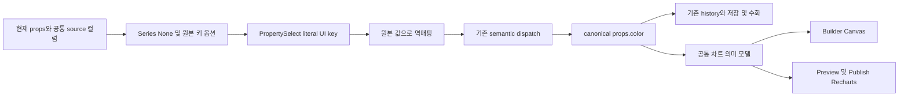

# ADR-209 후속 보완 상세 설계 — 시리즈 해제와 G5/G6 종결

작성: 2026-09-09. 문서 상태: 상세 설계 작성 완료, **제품 구현 미착수**. 코드 조사 기준: `2e0b0fab8` 및 당시 작업 트리. 조사 중 병행된 AI·i18n 변경은 이 설계의 구현 또는 검증 결과에 포함하지 않는다.

상위 결정은 [ADR-209](../209-chart-authoring-canvas-recharts-runtime.md), 기존 전체 구현 계획은 [원 설계 breakdown](209-chart-authoring-canvas-recharts-runtime-breakdown.md)이다. 본 문서는 ADR-209의 남은 보완·검증을 구체화한다. ADR 상태는 **In Progress**, G5/G6는 미종결로 유지한다.

## 1. Context — 범위와 현재 근거

### 1.1 이번 후속 보완의 경계

| 항목                     | 이번 설계의 책임                                                                        | 완료의 의미                                                  |
| ------------------------ | --------------------------------------------------------------------------------------- | ------------------------------------------------------------ |
| 요구사항 D1: 시리즈 해제 | 연결한 Series 필드를 명시적으로 해제하고 다시 선택할 수 있게 한다                       | 실제 Properties 조작부터 저장·재열기·두 렌더러까지 해제 유지 |
| 기존 편집·데이터 계약    | 원본/ref, Undo/Redo, 저장/수화, collection, 필드 라벨·언어, padding·행 편집의 회귀 검증 | 기존 수정의 효과가 최종 revision에서도 유지됨을 확인         |
| G5 잔여                  | production 번들·네트워크·성능 근거와 기존 초기 번들 예산의 판정                         | 순증과 전체 예산을 별도로 판정하고 실제 Builder 부트를 확인  |
| G6 잔여                  | 호환성·rollback·최종 revision·사용자 흐름 증거를 연결                                   | 미해결 필수 조건 없이 ADR 종결 가능                          |

shadcn 대비 추가 요구사항 D2–D4, C1–C7, V1–V6, X1–X5는 이번 완료 조건에 넣지 않는다. 필드 타입 안내·여러 수치 컬럼 매핑·시리즈 메타데이터·formatter·축/tooltip/legend 확장·차트별 표현 추가·필터/선택/템플릿은 별도 확장 설계 대상이다. 이번 문서가 그 확장 ADR을 생성하거나 승인하지 않는다.

6개 저작 항목과 단일 `Chart` 저장 타입, Builder 정적 Canvas / Preview·Publish Recharts 분리, 공통 collection 공급, `dimension/metric/color` 저장 키를 유지한다. Chart 전용 fetch/store, DB schema, 새 public chart prop은 추가하지 않는다. SSOT 영역은 **D2 Props/API 보완**이 중심이며, D1 DOM/접근성은 Select 선택 표현 검증, D3 시각 스타일은 기존 Canvas/DOM 정합 검증으로 제한한다. 여기의 SSOT D1과 요구사항 번호 D1은 서로 다른 분류다.

### 1.2 현재 코드로 확인한 원인과 경계

아래 경로는 저장소 루트 기준이며 줄 번호는 조사 시점의 위치다. 코드에서 확인한 동작과 아직 실행하지 않은 재현을 구분한다.

| 현재 근거                                                                                 | 확인한 사실                                                                                              | 후속 조치                                                               |
| ----------------------------------------------------------------------------------------- | -------------------------------------------------------------------------------------------------------- | ----------------------------------------------------------------------- |
| `apps/builder/src/builder/panels/properties/PropertiesPanel.tsx:146`                      | 필드 옵션이 현재 값과 collection 컬럼의 합집합이다. Series에 값이 있으면 빈 값 옵션을 별도로 넣지 않는다 | 실제 옵션 생성 경로에 Series 해제 항목 추가                             |
| `apps/builder/src/builder/components/property/PropertySelect.tsx:74`                      | `reset`을 받으면 `onChange("")`로 변환한다                                                               | 원본 컬럼 키 `reset`과 UI 초기화 명령 분리                              |
| 같은 파일 `:96`, `:125`                                                                   | 빈 값은 `selectedKey=null` 또는 `reset`이 되고, item `key/id`에는 원본 값을 그대로 쓴다                  | 빈 값을 선택 항목으로 표현할 수 있는 UI 식별자 도입                     |
| `apps/builder/src/builder/panels/properties/generic/GenericFieldRenderer.tsx:182`, `:390` | `literalOptionFields`는 현재 라벨 번역만 끈다. 선택 값 처리에는 영향을 주지 않는다                       | 라벨 정책과 별도로 literal 값 모드를 전달                               |
| `apps/builder/src/builder/panels/properties/hooks/useOwnerCollectionColumns.ts:53`        | 알려진 DataTable schema·mock/legacy 행에서 컬럼을 찾고, 없으면 기존 입력 경로를 사용한다                 | 컬럼 추론 범위를 넓히지 않고 현재 fallback 유지                         |
| `PropertiesPanel.tsx:172`, `semanticUpdateDispatch.ts:47`                                 | ref를 해소한 현재 값과 patch를 비교하고 공통 semantic dispatch로 쓴다                                    | 기존 쓰기 진입점 유지, 별도 store/history 경로 금지                     |
| `apps/builder/src/builder/stores/canonical/canonicalDocumentStore.ts:306`                 | props patch의 `undefined`는 삭제하고 `""`는 값으로 남긴다                                                | 해제는 명시적 `color: ""`로 저장                                        |
| `packages/specs/src/chart/series.ts:68`                                                   | `color`가 비어 있으면 단일 시리즈, 동일 범주/시리즈 값은 합산한다                                        | 기존 의미 모델 재사용, 행 재작성 금지                                   |
| `apps/builder/src/resolvers/canonical/extractCanonicalProps.ts:22`                        | extension의 dataBinding을 wrapper 소비용 prop으로 전달한다                                               | canonical `x-composition.dataBinding` 권위와 소비자 전달 모두 회귀 검증 |

현재 값이 있는 Series의 해제 항목 누락과 `reset` 충돌은 코드로 확인했다. 이 설계 작성 중 실제 화면에서 해제 실패를 재현하거나 수정 후 통과를 측정한 것은 아니다. 첫 구현 단계에서 실제 옵션 생산자와 사용자 선택을 통과하는 실패 증거를 먼저 남긴다.

**Round 3 보강 — 옵션 생산자의 입력 채널(M1).** `PropertiesPanel.tsx:149-153`의 `columns`는 `contract.fields`의 `currentValue`를 모은 `props.dataBinding`에서 온다. `useEditContract.ts:37-43`는 canonical 노드를 직접 `resolveEditContract`에 전달하고, `packages/shared/src/catalog/resolvers/resolveEditContract.ts:146-152,350-360`은 `node.props`만 읽는다. runtime의 `extractCanonicalPropsFromResolved` 투영이 이 편집 계약에도 적용된다고 가정하면 안 된다. extension-only와 props 대조 입력의 실제 resolver 호출 결과 및 남은 화면 검증은 §10.3에 기록한다.

### 1.3 외부 참조의 적용 범위

React Aria는 collection item의 고유 `id`로 선택과 항목 갱신을 추적하며, `array.map` 사용 시 `key`와 `id`를 지정한다. 따라서 표시 라벨·업무 데이터 값과 UI item 식별자를 분리하는 것은 기존 collection 모델 안에서 가능한 설계다. 이 원칙을 적용하되, 현재 설치된 RAC의 `selectedKey/onSelectionChange` 경로를 유지한다. 최신 문서의 API 이름을 이유로 RAC 버전을 올리지 않는다. [React Aria Collections](https://react-aria.adobe.com/collections#unique-ids), [Select](https://react-aria.adobe.com/Select) (2026-09-09 확인).

## 2. Alternatives — 시리즈 해제 대안과 위험

| 대안 | 방법                                                                | 기술 위험                             | 성능 위험                         | 유지보수 위험                              | 마이그레이션 위험                        |
| ---- | ------------------------------------------------------------------- | ------------------------------------- | --------------------------------- | ------------------------------------------ | ---------------------------------------- |
| A    | 현재 옵션에 `""` 또는 `reset` 항목만 추가                           | HIGH — 선택 상태/원본 키 충돌이 남음  | LOW — 옵션 1개                    | MEDIUM — 특수 문자열 예외 누적             | HIGH — 실제 `reset` 필드가 해제로 저장됨 |
| B    | Chart 전용 Select를 만들고 별도 값 변환                             | MEDIUM — 새 UI 경계 검증              | LOW — 작은 UI 코드 추가           | MEDIUM — focus/popover/i18n 공통 제어 중복 | LOW — 저장 키 유지 가능                  |
| C    | 공통 PropertySelect에 선택적 literal 값 모드, Chart 필드에서만 사용 | MEDIUM — 기존 모드와의 분기 검증 필요 | LOW — 컬럼 수에 비례한 UI 키 변환 | LOW — 기존 컨트롤·쓰기 경로 재사용         | LOW — 저장 형식 변경 없음                |

## 3. Threshold Check

A는 해제 결함을 부분적으로만 가리고 저장 값도 잘못 바꿀 수 있어 기각한다. C의 추가 기술 위험은 기존 값 모드를 보존하는 조건에서 MEDIUM으로 평가한다. B도 저장 형식 변경 없이 가능하지만 공통 UI 제어를 중복하므로 기각한다. 따라서 근본 구조 전환 없이 C를 채택한다. 잘못 구현했을 때의 데이터 영향과 기존 G5/G6에서 승계한 HIGH 위험은 §5의 별도 게이트로 관리한다. 공통 컨트롤 전체를 literal 모드로 전환하거나 라벨 번역 여부에서 값 처리 모드를 추론하지 않는다.

## 4. Decision — 사용자 동작과 저장 계약

### 4.1 옵션 구성과 사용자 동작

1. 컬럼 목록이 있는 Chart의 **Series**에 `없음 / None`을 항상 첫 항목으로 제공한다. 저장 값은 `""`이며 라벨은 기존 `chart.none` 번역을 사용한다.
2. 그 뒤에 비어 있지 않은 현재 값과 source 컬럼을 중복 없이 표시한다. 현재 필드가 source에서 사라져도 현재 값을 보존하며, 화면을 열거나 source schema가 바뀐 것만으로 다른 필드를 자동 선택하지 않는다.
3. Category/Value에는 새 해제 명령을 추가하지 않는다. 기존의 미설정 값 표현은 유지하고, 원본 키 `reset` 등이 손상 없이 선택되도록 literal 모드는 세 매핑 필드에 공통 적용한다. 현재 값이 `""`여서 기존 옵션에 이미 포함된 항목은 literal 모드에서 선택 가능한 빈 값 항목이 되며 저장 값은 그대로 `""`다. 현재 값이 비어 있지 않으면 새 빈 값 항목을 추가하지 않는다(L2).
4. schema가 없는 API·정적 데이터 등은 기존 문자열 입력을 유지한다. Series 입력을 비우면 같은 해제 계약을 적용한다. 새 비동기 schema 탐색이나 다른 데이터 컴포넌트의 컬럼 추론 변경은 하지 않는다. 단, 연결된 DataTable과 schema가 실제로 존재하는데 extension의 binding을 편집 계약이 읽지 못해 문자열 입력이 된 경우는 정상 fallback으로 통과시키지 않는다. F0에서 기존 바인딩 소비 경로의 누락으로 판정한다(M1).
5. None 선택 후 트리거에도 `없음 / None`이 표시되고 팝업이 닫힌다. 키보드 선택·Escape 취소·닫힌 뒤 focus 복원은 공통 컨트롤 동작을 따른다. 취소는 데이터 변경이 아니다.
6. 언어 전환은 역할 라벨·None 라벨만 바꾼다. `Value`, `Series`, `reset`, 한글 컬럼명 등 원본 키와 행 값은 번역하거나 정규화하지 않는다.

실제 필드명이 번역된 None 라벨과 같으면 해제 항목과 데이터 필드를 구분할 수 있어야 한다. 해당 충돌에 한해 데이터 항목에 지역화된 보조 표시 `필드 / Field`를 덧붙이되 원본 키 부분은 그대로 표시하고 저장 값은 바꾸지 않는다. 이 표시는 options의 표시 라벨에서 해결하며 공통 Select에 Chart 전용 분기를 넣지 않는다. 보조 문구는 기존 번역 키 재사용 여부를 확인한 뒤 없으면 ko/en을 함께 추가한다.

### 4.2 UI 선택 키와 업무 값 분리

공통 `PropertySelect`에 다음과 같은 opt-in 인터페이스를 추가한다. 명칭은 아래로 제안하며 기존 호출의 기본값은 `legacy`다.

```ts
optionValueMode?: "legacy" | "literal";
```

| 구분           | legacy 모드                     | literal 모드                                               |
| -------------- | ------------------------------- | ---------------------------------------------------------- |
| 사용처         | 기존 스타일 초기화 및 일반 enum | Chart의 dimension/metric/color 필드                        |
| item key/id    | 현재 방식 유지                  | 원본 string을 일대일 대응하는 비어 있지 않은 UI key로 변환 |
| `reset` 선택   | 기존 `onChange("")` 유지        | 원본 문자열 `"reset"` 그대로 전달                          |
| 빈 문자열 옵션 | 기존 선택 없음/초기화 처리      | 유효한 item 선택으로 표현, 표시 라벨도 보임                |
| null 선택/취소 | 기존 동작 유지                  | 변경을 발행하지 않음. 해제는 명시적 None 선택만            |
| 저장 값        | 현재 방식 유지                  | UI key를 역매핑한 원본 string만 전달                       |

literal key는 예를 들어 `"value:" + JSON.stringify(value)`로 만든다. `""`, `"reset"`, `"value:\"\""` 등 서로 다른 문자열이 충돌하지 않아야 한다. 선택 시 **현재 options에서 대응 항목을 찾아** 원본 `option.value`를 전달한다. 이벤트 문자열을 임의로 JSON 파싱하거나 UI key 자체를 저장하지 않는다. options에 없는 key와 null은 no-op이다. key는 locale·목록 순서·라벨에 의존하지 않는다.

`GenericFieldRenderer.literalOptionFields`에서 해당 필드에 `optionValueMode="literal"`과 기존 `translateOptions=false`를 각각 전달한다. 두 정책은 명시적으로 함께 연결하되 `translateOptions=false` 자체가 literal 모드를 활성화하지 않는다. `GenericField` 및 `PropertySelect`의 memo 비교에도 새 prop을 반영한다. 별도 persisted option map, 새 Zustand slice, 새 selection mirror는 만들지 않는다.

빈 문자열 자체를 이름으로 가진 데이터 컬럼 지원은 추가하지 않는다. 기존 Chart의 빈 필드 값은 미설정 의미이며, 이번 설계에서도 그 계약을 유지한다.

### 4.3 canonical·ref·저장 불변식

| 행위/상태                                 | canonical 결과                    | 지켜야 할 조건                                               |
| ----------------------------------------- | --------------------------------- | ------------------------------------------------------------ |
| `color: "series"`에서 None 선택           | `props.color: ""`                 | `dimension`, `metric`, `data`, dataBinding 변화 없음         |
| origin이 `color: "series"`인 ref에서 해제 | ref의 명시적 `color: ""` override | origin과 다른 인스턴스는 변경 없음                           |
| 명시적으로 해제한 뒤 Undo / Redo          | 직전 값 복원 / `""` 재적용        | 기존 store의 undo/redo 경로, 독립 history 구현 없음          |
| legacy 문서에 color가 없음                | 조회만으로는 계속 없음            | mount·선택 이동·locale 전환·수화가 `""`를 자동 기록하지 않음 |
| None 상태에서 사용자가 필드 선택          | 원본 필드 key                     | 공백 제거·소문자화·번역·예약 문자열 치환 없음                |
| 이미 명시적 `color: ""`에서 None 재선택   | 값 유지                           | 의미 없는 history/persist 추가 없음                          |

해제를 `undefined`/삭제로 표현하면 ref가 origin의 시리즈를 다시 상속할 수 있다. 그러므로 사용자가 명시적으로 해제한 상태는 `""`로 저장한다. legacy의 생략 상태를 일괄 `""`로 옮기지는 않는다. legacy 미설정 상태에서 사용자가 None을 명시적으로 선택해 `""`를 기록하는 것은 사용자 편집으로 취급한다.

쓰기 흐름은 `PropertiesPanel.handleSemanticPatch` → `dispatchSemanticUpdateWithPropagation` → 기존 inspector action → canonical 갱신/기존 history·저장이다. 선택 대상 ref 해소와 변경 값 비교를 우회하지 않는다. 저장 완료는 메모리 갱신만으로 판정하지 않고 영속화가 끝난 뒤 reload로 확인한다.



`dataBinding`의 canonical 원천은 `x-composition` extension이다. wrapper가 받는 `dataBinding` prop은 `extractCanonicalPropsFromResolved`의 소비용 투영이다. 이번 변경으로 이를 canonical props에 중복 저장하거나 Chart 전용 공급 경로를 만들지 않는다.

### 4.4 집계와 화면 결과

해제는 시리즈 구분 필드만 비운다. 행과 범주/수치 필드는 유지하고, `buildSeriesGrid`의 기존 단일 시리즈 합산을 사용한다. Canvas와 Recharts에서 별도 합산을 구현하지 않는다. 차트 유형·프리셋·animation 설정도 해제로 덮어쓰지 않는다.

Builder는 정적 완료 모습을 표시하고 animation·hover는 Preview/Publish runtime에 남긴다. 해제로 시리즈 수·팔레트 배치가 바뀌는 것은 기존 의미 모델의 결과다. 신규 시리즈별 색 저장이나 해제 전 색의 고정 기능은 이번 범위가 아니다.

## 5. Risks — 잔존 위험

| ID        | 위험                                                                                   | 심각도 | 대응/게이트                                                                  |
| --------- | -------------------------------------------------------------------------------------- | ------ | ---------------------------------------------------------------------------- |
| F-R1      | 삭제와 빈 값이 섞여 ref 수화 뒤 그룹이 복구되거나 origin이 바뀜                        | HIGH   | §4.3 명시적 빈 값, F1/F2 원본·ref·저장 대조                                  |
| F-R2      | 공통 Select 변경이 스타일 reset·focus·memo 또는 실제 `reset` 필드를 깨뜨림             | MEDIUM | 기본 legacy 유지, F1 두 모드 상호 회귀와 키보드 조작                         |
| F-R3      | UI unit test만 통과하고 실제 옵션 생산자·쓰기 경로를 통과하지 않음                     | HIGH   | F0 실제 패널 실패 재현, F1 실제 store, F2 가시 Builder 흐름                  |
| F-R4      | 구 revision 숫자를 최신 결과로 쓰거나 로그인 실패를 Builder 요청 0으로 처리            | HIGH   | F3/F4 revision·manifest·network·readiness 묶음                               |
| F-R5      | 전체 초기 500KB 초과를 작은 순증으로 자동 면제                                         | HIGH   | F3 예산별 판정, 명시적 정책 결정 없으면 G5/G6 열림                           |
| F-R6      | 새 export envelope의 구 importer 실패를 문서 rollback과 혼동                           | MEDIUM | F2 구 버전 store와 importer를 별도 판정, §10 호환 범위 명시                  |
| F-R7 (M1) | props에 binding을 심은 fixture가 extension-only canonical 입력의 편집 계약 누락을 가림 | MEDIUM | F0의 extension-only 실제 패널 검증. schema 존재와 binding 도달을 분리해 판정 |

## 6. 구현 경계와 실행 순서

아래는 **다음 구현의 계획**이며 이 문서 작성 시 실행한 작업이 아니다. 회귀 수리가 필요한 경우 재현한 실패의 소유 경계만 수정한다.

| 경계                                                                                  | 계획한 변경 또는 검증                                                              |
| ------------------------------------------------------------------------------------- | ---------------------------------------------------------------------------------- |
| `apps/builder/src/builder/panels/properties/PropertiesPanel.tsx`                      | Chart 옵션 생성에 Series None 추가, 현재/원본 키 보존, 충돌 라벨 처리              |
| `apps/builder/src/builder/components/property/PropertySelect.tsx`                     | opt-in literal 모드, UI key 역매핑, 빈 값 선택 표시, memo 조건                     |
| `apps/builder/src/builder/panels/properties/generic/GenericFieldRenderer.tsx`         | literal 필드의 값 모드 전달 및 memo 조건                                           |
| `apps/builder/src/builder/panels/properties/ChartLabels.test.tsx` 및 인접 패널 테스트 | 실제 Chart 옵션 생산자 검증, locale·라벨 충돌·현재 키 보존                         |
| PropertySelect 인접 테스트 및 기존 `generic/GenericFieldRenderer.test.tsx`            | 두 모드, None/reset·특수 문자열, 값 전달·취소·rerender                             |
| `apps/builder/src/builder/stores/utils/__tests__/chartInstanceCompatibility.test.ts`  | ref 명시적 빈 값, origin 독립성, Undo/Redo·직렬화·수화                             |
| `packages/specs/src/chart/__tests__/series.test.ts`                                   | 손계산 집계 오라클로 그룹 유무 비교                                                |
| `packages/shared/src/utils/__tests__/chartDocumentCompatibility.test.ts`              | 6종 저장·export/import의 빈 값과 binding 보존                                      |
| `packages/shared/src/components/chart/*.browser.test.tsx`                             | 기존 Recharts·padding·interaction·collection 계약에 해제 시나리오 연결             |
| canonical resolver/scene의 기존 dataBinding 테스트                                    | 소비용 투영과 Canvas 실제 행 공급 재검증. 실패가 없으면 제품 코드 변경 없음        |
| i18n 번역 파일                                                                        | None 충돌 보조 문구에 재사용할 키가 없을 때만 ko/en 최소 추가. 병행 번역 변경 보존 |

순서는 다음 세 단계로 묶는다. 중간마다 새 ADR을 만들거나 별도 데이터 모델을 추가하지 않는다.

1. **실패 재현과 D1 수리**: F0 → 옵션/선택 값 경계 수정 → F1. 먼저 extension-only 바인딩의 실제 패널 입력 채널을 확인한다. schema가 있는 source의 소비 누락이 재현되면 기존 편집 계약의 읽기 경계를 수리한 뒤 origin의 Series 해제와 실제 `reset` 필드 선택을 고정하고 같은 경로로 ref를 검증한다.
2. **기존 계약 회귀 확인**: F2. 실제 저장·재열기·Preview·독립 Publish에서 같은 source를 대조하고, 발견된 회귀만 해당 경계에서 수리한다.
3. **종결 근거 작성**: 최종 후보 revision에서 F3/F4 → 정책 판정 → F5. 예산 결정이나 실제 인증 환경이 없어도 독립적으로 가능한 측정·호환 검증은 먼저 끝내고, 미충족 gate만 열린 채 보고한다.

이번 보완의 제품 변경 핵심은 세 UI 파일이다. M1이 실제 패널에서 재현되면 `useEditContract`/`resolveEditContract`의 기존 바인딩 소비 경계도 최소 수리 후보가 된다. 공통 extension 읽기 계약을 재사용하고 ref의 유효 binding을 보존하며, UI를 위해 canonical `props.dataBinding`을 다시 저장하는 방식은 금지한다. canonical/data/runtime 파일은 우선 검증 대상이다. 근거 없이 공통 데이터·렌더 구조를 다시 설계하는 작업으로 확대하지 않는다.

## 7. 회귀 검증과 독립 오라클

### 7.1 첫 실패와 핵심 fixture

F0의 첫 확인은 컬럼 `category/value/series`를 가진 공통 DataTable을 준비하고, **binding을 `x-composition.dataBinding`에만 둔 Chart**를 canonical document에 넣어 실제 Properties를 여는 것이다. `props.dataBinding`이 없음을 fixture 전제와 저장 문서 양쪽에서 확인한다. `useEditContract`나 옵션 배열을 mock하지 않고, 선택된 Chart의 실제 패널 또는 실제 패널이 호출하는 옵션 생산자를 통과한다. legacy 변환 helper를 거칠 경우 extension-only 전제가 유지됐는지도 확인한다(M1).

기록할 값은 canonical binding 위치, `contract.fields[dataBinding].currentValue`, source의 schema 존재 여부, 최종 Series 컨트롤 종류다. schema가 존재하면 컬럼 Select가 기대 결과이며, 편집 계약의 binding 누락으로 문자열 입력이 나오면 바인딩 소비 누락의 실패를 고정한다. source 자체에 schema가 없을 때만 §4.1 4항의 문자열 fallback으로 판정한다. 추가로 `updateSelectedDataBinding`으로 연결한 Chart의 저장 결과·재열기를 확인해 import fixture와 실제 저작 경로를 대조한다.

컬럼 Select 경로에서 `color="series"`일 때 **실제 Properties 옵션 생성 결과에 None이 없다는 실패**를 고정한다. 테스트가 `props.dataBinding`을 별도로 심거나 None 옵션을 직접 만들어 GenericFieldRenderer에 전달한 결과만으로 F0를 통과시킬 수 없다. props에 binding을 둔 입력은 원인 비교용 대조군이며 canonical 성공 fixture가 아니다.

두 번째 실패는 원본 컬럼명을 `reset`으로 두고 Category/Value/Series에서 선택했을 때 저장 값이 `"reset"`인지 확인한다. 현재 code path의 치환을 재현하되, 이 설계가 이미 live 실패를 관측했다고 기록하지 않는다.

집계 fixture는 다음 7행을 사용한다. `dimension="category"`, `metric="value"`이며 값은 모두 양수다.

| category | series | value |
| -------- | ------ | ----: |
| Jan      | A      |    10 |
| Jan      | B      |    20 |
| Jan      | A      |     3 |
| Feb      | A      |     5 |
| Feb      | B      |     7 |
| Mar      | A      |     2 |
| Mar      | B      |     4 |

손계산 기대값은 그룹 A=`[13, 5, 2]`, B=`[20, 7, 4]`, 해제 후 단일 시리즈=`[33, 12, 6]`, 전체 합계=`51`이다. production helper의 출력을 복사해 기대값으로 만들지 않는다. 3개 범주를 유지해 Radar를 포함한 6종에서 적용한다. Pie/Radial의 분할·링·각도는 각 타입의 기존 의미 계약에 맞춰 이 집계값으로 확인한다.

### 7.2 회귀 매트릭스

| ID  | 입력/사용자 흐름                                                                    | 독립 확인값과 통과 조건                                                                                        |
| --- | ----------------------------------------------------------------------------------- | -------------------------------------------------------------------------------------------------------------- |
| T1  | 연결된 Series → None → 다른 필드                                                    | 실제 트리거 라벨, canonical `color`, 집계가 함께 전환. 팝업 닫힘/focus 유지                                    |
| T2  | `reset`, `Value`, `Series`, 한글, UI key 형태의 원본 키; None 라벨과 같은 이름      | key 무손실, None과 실제 필드 구분, 중복 item key/선택 경고 없음                                                |
| T3  | 기존 스타일 Select의 reset, 일반 enum 선택                                          | 기존 빈 값 전달·선택 표시·키보드 흐름 유지                                                                     |
| T4  | origin/ref/다른 ref, 패널/semantic dispatch → 실제 inspector store로 해제·Undo·Redo | 대상 ref만 빈 값 override, origin/다른 ref 불변. sanitize·override map 경유 확인 후 store의 undo()/redo() 사용 |
| T5  | 저장 완료 → refresh → export/import → 재선택                                        | 빈 값·차트 종류·기존 숨긴 옵션·animation·binding 보존, 미편집 문서 강제 재직렬화 0                             |
| T6  | ko ↔ en, 선택 이동, panel 재열기                                                    | 역할/None/보조 라벨만 변경, 원본 key·row·canonical version/history 불변                                        |
| T7  | schema의 현재 필드 삭제/추가, 컬럼 없음, legacy color 생략                          | 기존 값 유지, 기존 문자열 입력 fallback, 자동 필드 선택·문서 patch 없음                                        |
| T8  | 6종, 프리셋 적용·유형 변경 전후 해제                                                | 데이터 매핑 유지, 타입에 유효한 옵션만 노출, Chart Type 기본 dropdown 재등장 없음                              |
| T9  | 동일 source를 Chart와 기존 collection 소비 컴포넌트에 연결                          | 같은 source revision/행 값, source 업데이트 전파. Chart 전용 fetch/샘플 fallback 없음                          |
| T10 | Preview cold reload 및 독립 Publish, 정적/DataTable/실제 API의 로딩·빈 값·오류·회복 | 공통 공급 상태 일치, canonical extension binding 소비 확인, 실패를 샘플 데이터로 대체하지 않음                 |
| T11 | 기본 행 편집/삭제/Undo, id 없는 행·중복 id, Chart 재선택                            | 올바른 행 변경, 원본에 UI id 주입 0, 해당 재현의 React key/선택 경고 0                                         |
| T12 | 외부 padding 네 방향, light/dark, resize                                            | Canvas plot 경계와 Preview/Publish content box 정합, 역할 라벨 및 기존 토큰 유지                               |
| T13 | animation on/off, reduced-motion, tooltip·키보드, 해제 후 데이터 교체               | Canvas 정적 결과와 runtime 완료 결과 정합, runtime 애니메이션 프레임의 canonical write 0                       |

T1–T8은 이번 수정의 필수 회귀다. T9–T13은 ADR-209 기존 계약과 과거 수정의 최종 revision 확인이다. 과거의 padding·라벨·중복 key·dataBinding 수리를 새로운 미구현 기능으로 세지 않는다. 사용자 콘솔 붙여넣기 전체 원문이 현재 근거에 없으므로 그 로그 전체를 해결했다고 판정하지 않는다.

T5의 DB 검증은 in-memory serialize/parse 테스트와 별도로 실제 저장 완료 후 refresh를 수행한다. ref의 해소 결과뿐 아니라 저장 문서에 `color: ""`가 남는지도 확인한다. 네트워크 API 검증에는 현재 지원 transport를 사용하며, server execution을 지원하지 않는 환경에서 임의의 client fallback이나 credential 이동을 만들지 않는다.

T4는 패널의 `updateSelectedProperties`, 또는 `dispatchSemanticUpdateWithPropagation`에서 **실제 store의 inspector action**으로 이어지는 경로를 사용한다. 기존 `chartInstanceCompatibility.test.ts:48-50`의 `updateElementProps` 검증은 유지할 수 있지만 이 경로를 대신하지 않는다. 선택 상태를 설정하고 sanitize·ref override map·canonical 갱신을 확인한 뒤 store의 Undo/Redo를 실행한다(L1).

### 7.3 시각·행 수 오라클

정합 비교에서는 두 렌더러에 **같은 rows·source revision·크기·토큰**을 제공한다. 의미 값/축/범례/색은 정확히 대조하고 주요 기하 오차는 기존 ADR 기준인 ≤1 CSS px를 유지한다. Line/Area 곡선은 앵커뿐 아니라 구간 중간점을 포함한다. runtime-only 애니메이션 중간 프레임은 Canvas 정적 그림과 직접 비교하지 않는다.

Builder의 200행 샘플과 runtime의 전체 현재 결과는 별도 검증한다. 201번째 행에 식별 가능한 값을 두어 Preview/Publish 내부 절삭이 없음을 확인한다. 5000행은 규모 한계 보고용이다. sample/full 결과가 달라지는 것을 기하 오류로 처리하거나, 같은 그림을 만들기 위해 runtime 행을 절삭하지 않는다.

### 7.4 실행 명령과 live 증거

다음은 구현 후 저장소 루트에서 실행할 명령이다. 신규 테스트 파일명은 구현 시 인접 기존 테스트에 맞춰 확정하고 manifest에 남긴다.

```sh
pnpm -F @composition/builder exec vitest run src/builder/panels/properties/ChartLabels.test.tsx src/builder/panels/properties/generic/GenericFieldRenderer.test.tsx src/builder/stores/utils/__tests__/chartInstanceCompatibility.test.ts
pnpm -F @composition/specs exec vitest run src/chart/__tests__/series.test.ts
pnpm -F @composition/shared exec vitest run src/utils/__tests__/chartDocumentCompatibility.test.ts
pnpm -F @composition/builder exec vitest run --config vitest.chart.config.ts
pnpm run codex:typecheck
pnpm run codex:preflight
```

실제 Builder에서 T1/T4/T5/T6/T9/T11/T12를 한 사용자 흐름으로 연결하고, Preview와 독립 Publish에서 T10/T13을 확인한다. 화면은 chart와 전체 관련 Properties/Styles 영역을 함께 남긴다. 브라우저 unit 통과만으로 populated Builder live 검증을 대체하지 않는다. 무관한 동시 작업이 dirty라면 전체 formatter를 실행하지 말고 소유 파일 포맷과 읽기 전용 게이트로 나눈 뒤 최종 통합 preflight 여부를 별도로 보고한다.

## 8. G5 측정과 예산 판정

### 8.1 과거 결과는 비교 근거이며 최종 PASS가 아니다

로컬 evidence `docs/adr/evidence/209-execution-live.md`와 `209-bundle-closure.json`에는 다음 값이 남아 있다. JSON의 revision 표시는 `baseline/current`이므로 exact SHA를 자체적으로 증명하지 않는다. 아래 값은 **과거 측정값**이며 이번 설계에서 다시 build하거나 측정하지 않았다.

| 대상    | 이전 initial gzip B | 당시 변경 후 initial gzip B | 순증 B | 차트 lazy 순증 B |
| ------- | ------------------: | --------------------------: | -----: | ---------------: |
| Builder |           1,364,128 |                   1,369,077 | +4,949 |          118,701 |
| Preview |             685,820 |                     689,675 | +3,855 |          119,799 |
| Publish |             425,346 |                     425,139 |   -207 |          119,579 |

순증은 당시 10 KiB/200 KiB 예산 안이지만 Builder/Preview 전체 초기 값은 500KB를 초과한다. 이전 코드가 이미 초과했다는 사실만으로 승인된 예외가 생기지 않는다. 이후 padding·i18n·binding 변경과 현재 보완을 포함한 최종 revision에 이 숫자를 그대로 붙이지 않는다.

과거 runtime static 200행×4series의 6종 p95는 40.0–48.5ms로 기록되어 있다. 5000행 Bar/Radial은 각각 799.3/1018.7ms여서 불리 조건 보고가 필요하다. 이 값도 현재 성능 보증이 아니다. 과거의 첫 chunk 응답 10.8ms는 전송 관측이며 render/evaluation 완료 시간으로 쓰지 않는다.

### 8.2 최종 evidence manifest

각 측정 묶음에 다음 필드를 남긴다. 구 evidence 파일을 덮어써 이력을 없애지 않는다.

| 범주        | 필수 정보                                                                                                            |
| ----------- | -------------------------------------------------------------------------------------------------------------------- |
| 코드 동일성 | 정확한 before/after commit SHA, dirty patch 유무와 hash, lockfile hash, 측정과 종결 대상 revision의 관계             |
| 재현 환경   | build 명령/Node·pnpm·브라우저 버전, OS/CPU, DPR·viewport, foreground/visibility, heap 전후, 캐시·service worker 상태 |
| 입력        | 실제 프로젝트 출처와 익명 fixture ID, 차트 종류/props, source revision, 입력 행 수·시리즈 수, 샘플 정책              |
| 번들        | 각 entry와 manifest, 정적 import closure, lazy 전이 closure, 파일별 raw/gzip byte, gzip 설정, 중복 제거 집합         |
| runtime     | 반복 수/warm-up, 각 sample 원시값·p95 산법, 입력/최종 기하/안정화 시점, longtask·총 frame 비용, 성공/실패            |
| 네트워크    | entry URL·로그인/프로젝트 ready 증거, request 로그/HAR, chart lazy closure 파일과 전이 의존성 대조                   |

차트 도입 전 기준과의 전체 순증, 이번 D1 수정 전후의 국소 차이를 구분한다. 기존 기록의 기준 `31dff0c50`을 사용할 때에는 해당 worktree·lockfile을 실제로 복원해 같은 도구/환경으로 재측정한다. 중간의 무관한 변경을 모두 차트 비용으로 귀속하거나, 마지막 작은 수정만 비교해서 ADR 전체 순증이라고 부르지 않는다. baseline 재현이 불가능하면 그 비교는 미검증으로 기록한다.

### 8.3 번들 계산과 network 시나리오

production 산출물은 Builder, Preview, Publish를 각각 만든다. 단일 JS 파일 이름이나 Recharts 이름 포함 여부만으로 경계를 판정하지 않는다.

```sh
pnpm -F @composition/builder build
pnpm -F @composition/builder build:preview
pnpm -F @composition/publish build
```

entry의 정적 imports를 재귀 추적한 집합을 initial로 잡는다. Chart lazy entry의 정적 전이 의존성 전체에서 initial과 중복되는 파일을 빼고 lazy graph를 계산한다. 대응하는 추가 dynamic entry가 있으면 빠짐없이 별도 보고한다. before/after 모두 개별 JS 파일 `gzip -9`, timestamp 0 기준 합계를 사용하고 raw bytes도 함께 기록한다. 단위는 B와 KiB를 구별한다.

네트워크 검증은 production 서버와 visible foreground 브라우저에서 수행한다.

| 흐름                                                           | 요청/동작 통과 조건                                                                                  |
| -------------------------------------------------------------- | ---------------------------------------------------------------------------------------------------- |
| 로그인된 실제 populated Builder cold boot, Chart 포함 프로젝트 | 실제 프로젝트 hydration 및 해당 Canvas 제출/ready 확인까지 Recharts와 차트 runtime 전이 chunk 요청 0 |
| Builder에서 Chart 선택·속성 편집·재선택                        | Canvas로 갱신, 같은 chunk 요청 0. 로그인 화면만 본 결과는 무효                                       |
| 차트 없는 Preview cold load 및 독립 Publish cold load          | 각각 chart lazy graph 요청 0                                                                         |
| 같은 환경에서 차트 포함 페이지 최초 진입                       | 필요한 lazy graph가 로드되고 실제 Recharts 완료 그림 확인                                            |
| 차트 재선택/데이터 교체                                        | runtime 모듈 재다운로드 여부와 warm render 비용 보고; 서버 데이터 요청과 모듈 요청 구분              |

인증은 정상 지원 경로를 사용한다. production 로그인·프로젝트 접근이 불가능하면 개발 화면이나 로그인 페이지만으로 PASS를 만들지 않고 F4를 열어 둔다. 인증 우회 코드·무관한 보안 설정 변경은 해결책으로 삼지 않는다.

### 8.4 성능 조건

| 측정              | 입력/표본                                                                                           | 판정                                                                                                                     |
| ----------------- | --------------------------------------------------------------------------------------------------- | ------------------------------------------------------------------------------------------------------------------------ |
| Builder           | visible populated 프로젝트, 200행×4series, select/edit/zoom 및 불리한 resize, before/after 최소 5쌍 | 전체 frame 비용 p95 Δ≤1ms. 특정 함수 감소만으로 합격 처리하지 않음                                                       |
| runtime static    | 6종 각 200행×4series, animation off, 데이터 교체/resize 각각 3회 warm-up 후 최소 12회               | 입력→최종 정적 기하 p95≤100ms. 추가 안정화 대기 시간은 별도 표시                                                         |
| runtime animation | animation on/off와 reduced-motion, 데이터 교체·resize                                               | 실제 시작/마지막 기하 변경/설정 begin·duration을 따로 기록. elapsed에서 duration을 단순 차감해 static PASS를 만들지 않음 |
| 규모 한계         | 5000행, 6종의 데이터 교체·resize 최소 3회                                                           | 전체 결과·longtask·heap·지연 보고. 200행 기준과 직접 비교해 PASS를 만들거나 새로운 SLA를 선언하지 않음                   |
| 편집 불변성       | 애니메이션·hover·locale/단순 재선택                                                                 | 해당 동작의 불필요한 canonical write 0                                                                                   |

성능 수정이 필요하면 먼저 총 frame 비용에서 비싼 실제 단계를 특정한다. 이번 UI key 변환을 이유로 추측성 캐시, RAF 분산, downsampling을 추가하지 않는다. 기존 G4와 동일하게 샘플과 실제 입력의 출처를 기록한다.

### 8.5 전체 초기 500KB의 미결정 사항

기존 ADR은 전체 초기 `<500KB`와 초기 순증 `≤10 KiB gzip`, lazy 순증 `≤200 KiB gzip`을 별도 조건으로 둔다. 현재 증거는 gzip byte 기준이며, 전체 조건의 정확한 KB 단위/압축 기준도 최종 예산 기록에 명시해야 한다. 단위 선택으로 현재 Builder/Preview 초과가 해소되는 수준은 아니다.

| 정책 대안                         | G5 판정 영향                                                                                        | 작업 범위 영향                                           |
| --------------------------------- | --------------------------------------------------------------------------------------------------- | -------------------------------------------------------- |
| A. 기존 전체 예산 유지            | 전체 초기 기준을 충족하기 전 G5 미통과                                                              | 광범위한 초기 번들 축소가 필요하면 별도 범위 승인 필요   |
| B. 기존 초과에 한정한 명시적 예외 | 승인된 대상 entry·baseline B·최종 상한·유효 기간/후속 책임과 차트 순증 조건을 충족할 때만 판정 가능 | 차트 도입 비용과 기존 부채를 분리하되 예외를 문서에 기록 |

후속 보완의 범위를 유지하려면 **B를 제안**한다. 다만 이 문서 자체는 예외 승인이 아니며 수치 상한도 임의로 확정하지 않는다. 최종 manifest를 만든 뒤 A/B에 대한 사용자 결정을 받는다. 결정 전에는 순증 통과 사실만 기록하고 G5/G6 및 Implemented 승격을 닫지 않는다. 이 결정 대기는 상세 설계 작성이나 독립적인 회귀 검증을 막지 않는다.

## 9. Gates — G6 종결과 인수인계

F0–F5는 이번 보완의 확인 순서이며 상위 G0–G6를 대체하지 않는다. 과거 통과한 G0–G4를 전부 미통과로 되돌리지 않되 변경으로 영향을 받는 계약은 다시 검증한다.

| Gate | 시점 / 연결             | 통과 조건                                                                                                                                    | 실패 시 처리                                                                                                                               |
| ---- | ----------------------- | -------------------------------------------------------------------------------------------------------------------------------------------- | ------------------------------------------------------------------------------------------------------------------------------------------ |
| F0   | 수정 전 / G2·G3         | extension-only binding과 실제 schema로 패널 입력 채널 확인. binding 누락 여부와 실제 옵션 생산자의 None 누락·reset 오선택 실패를 구분해 고정 | schema가 있는데 문자열 입력이면 정상 fallback으로 통과시키지 않고 F1의 선행 수리로 연결. props binding/합성 옵션만 검증한 결과로 대체 금지 |
| F1   | D1 구현 후 / G2         | T1–T8의 UI·store 자동 검증, 두 값 모드와 ref 명시적 해제, 신규 helper가 실제 소비 경로에 연결                                                | 해당 UI/쓰기 경계 수리, renderer 우회 금지                                                                                                 |
| F2   | 회귀 완료 / G3·G4·G6    | §7의 저장/수화·실제 공통 source·6종 Canvas/Recharts·독립 Publish·rollback 검증과 live 증거                                                   | 관련 계약만 수리하고 실패 조합 재검증                                                                                                      |
| F3   | 최종 후보 / G5          | exact revision manifest, initial/lazy 전이 graph, 순증·전체 예산 각 판정, §8.4 성능 기준 충족                                                | 초과 원인 수리 또는 §8.5 명시적 예산 결정. 자동 예외 금지                                                                                  |
| F4   | production 검증 / G5·G6 | 로그인된 populated Builder boot/편집의 runtime 요청 0, 차트 없는 Preview/Publish 요청 0, 실제 runtime lazy 로드 증거                         | 인증/환경·경계 실패를 구별해 기록하고 미통과 유지                                                                                          |
| F5   | 종결 / G6               | F1–F4 충족, 최종 revision의 focused tests·cross-check·preflight·Live Exercise, 호환 제한과 관련 문서 일치                                    | 필수 조건이 남으면 In Progress 유지                                                                                                        |

F5에서 갱신할 문서는 ADR-209 상태/실행 기록, ADR README, 원 breakdown의 현재 상태, CHANGELOG, 검증 evidence다. `.claude/skills/component-design/SKILL.md:86`의 Recharts 범위 예외는 현재 이미 반영되어 있으므로 다시 작성할 과제로 세지 않고 최종 내용의 정합만 확인한다. ADR-194/207/208 전체를 Superseded로 바꾸지 않는다.

최종 완료 보고에는 exact SHA, 통과 gate, 명시적으로 수용한 예외, 실패/미측정 항목, evidence 위치를 함께 적는다. `docs/adr/evidence/`는 현재 gitignored인 로컬 경로이므로 로컬 파일만 링크하고 다른 개발자도 볼 수 있다고 가정하지 않는다. 보존할 요약·재현 명령·결정은 tracked ADR에 남기고, 원시 산출물의 공유 위치는 최종 인수인계에 명시한다. ignore 규칙 변경이나 force-add는 이 설계에 포함되지 않는다.

## 10. 호환성·롤백과 설계 검증 기록

### 10.1 호환성과 중단 조건

해제 저장은 기존 string prop의 빈 값이므로 새로운 문서 schema migration은 0이다. 단순히 호환된다고 추정하지 않고, 이전 버전의 실제 store/renderer에서 빈 값·숨긴 옵션·animation·ref 해소가 보존되는지 F2로 확인한다. UI 보완을 되돌리더라도 저장된 빈 값을 일괄 삭제하거나 source 행을 복구 명목으로 재작성하지 않는다.

과거 evidence에서 확인된 호환 범위는 구 버전 store의 문서 유지/편집/Undo와 새 export envelope의 구 strict importer 수용을 구분한다. 새 data-source envelope를 구 importer가 거부하는 제한을 `color: ""` 문제로 취급하거나 이번 작업에서 무조건 해결하지 않는다. G6 판정 시 실제 구 importer 결과와 지원할 rollback 경로를 명시한다. 기존 데이터 손실·강제 재직렬화가 재현되면 해당 gate를 통과시키지 않는다.

실행 중 canonical/origin 변경 누수, 잘못된 원본 key 저장, Chart 전용 데이터 우회, Builder의 Recharts 유입이 발견되면 해당 단계의 후속 전환을 중지하고 근거가 있는 경계를 수리한다. 전체 초기 예산 미결정과 production 인증 미확인은 구현 실패와 구별해 남긴다. 기존 행 데이터를 손상시키거나 gate 기준을 낮춰 종결하지 않는다.

### 10.2 이번 문서 작업의 검증

이번 작성의 판독 범위는 코드 원인·값 계약·구현 경계·게이트 정합이다. 전체 ADR의 독립 재리뷰나 제품 실행 검증을 완료했다는 뜻이 아니다. 최종 문서 점검 결과는 아래에 기록한다.

- [x] 현재 코드 경계와 링크 확인
- [x] 해제·원본 key·ref·저장/Undo 계약의 대안 및 위험 검토
- [x] 과거 측정과 최종 재측정, 승인 전 예산 예외 구분
- [x] 소유 문서 포맷·보호 파일·diff 검사
- [x] 상위 ADR은 In Progress, 제품 구현/테스트 미실행으로 상태 일치

2026-09-09 문서 검증: 소유 문서 2개의 `codex:guard`·명시 경로 `codex:format`, 로컬 링크/참조 경로/코드 fence/과거 번들 수치 대조, tracked·신규 파일 `git diff --check` 통과. `codex:agent-catalog` FAIL 0/WARN 0, `codex:engine-matrix` 일치, `codex:text-axis-matrix` drift 0. `codex:typecheck`·`codex:registration`은 TS 변경 없음으로 스킵됐다. 병행 작업의 전역 포맷을 피하기 위해 preflight 구성 명령을 개별 실행했다. 제품 focused tests·build·live 측정은 이 문서 작성 범위에서 실행하지 않았다.

### 10.3 Claude Code Round 3 반영과 M1 추가 확인

[리뷰 기록](../reviews/209.md)의 Round 3은 `93d5a8fc2` 기준 **구현 착수 가능**, HIGH 0 / MEDIUM 1 / LOW 2로 판정했다. 다음은 그 지적에 대한 작성자 보강이며, 원 리뷰 로그의 판정을 덮어쓰거나 새 전체 리뷰 라운드를 선언하지 않는다.

| 지적                                | 설계 반영                                                                           | 남은 구현 검증                                                                                        |
| ----------------------------------- | ----------------------------------------------------------------------------------- | ----------------------------------------------------------------------------------------------------- |
| M1: 옵션 생산자의 binding 입력 채널 | §1.2 채널 명시, §7.1 extension-only fixture와 schema 유무에 따른 판정, F0 선행 조건 | 실제 Properties와 `updateSelectedDataBinding` → 저장/재열기 경로. 소비 누락이 재현되면 해당 경계 수리 |
| L1: ref 테스트의 쓰기 경로          | T4를 패널/semantic dispatch → 실제 inspector store 경유로 명시                      | sanitize·override map·Undo/Redo를 그 경로에서 확인                                                    |
| L2: Category/Value의 기존 빈 값     | §4.1 3항에 기존 `""` 항목의 literal 선택 의미 명시                                  | 기존 빈 값 선택 유지, 비어 있지 않은 값에 새 해제 옵션을 추가하지 않음                                |

**코드·소규모 실행 근거 (`93d5a8fc2`).** `pnpm exec tsx -e`에서 실제 `resolveEditContract`를 import하고 동일 Chart props에 binding 위치만 바꾼 두 입력을 전달했다. 아래 `null`은 출력 시 미정의 값을 `?? null`로 표시한 것이며 저장 값이 아니다. 이 probe는 편집 계약 경계만 실행한 결과로, 실제 패널·store·DB 검증은 아니다.

| 입력                                                                                                                            | semantic dataBinding.currentValue       | color.kind |
| ------------------------------------------------------------------------------------------------------------------------------- | --------------------------------------- | ---------- |
| `props={dimension:"category",metric:"value",color:"series"}`, `x-composition.dataBinding={source:"dataTable",name:"review-m1"}` | 미정의 (`null`로 출력)                  | `string`   |
| 동일 props에 `dataBinding`을 넣은 대조군                                                                                        | `{source:"dataTable",name:"review-m1"}` | `string`   |

`color.kind=string`은 패널의 enum 변환 전 단계이므로 두 입력에서 같다는 것만으로 최종 컨트롤을 판정하지 않는다. 첫 입력의 **편집 계약 binding 누락은 실행 확인**됐고, 그 결과의 실제 화면 fallback은 F0에서 확인한다. `useCanonicalNode` → `selectCanonicalNode`는 저장 노드를 그대로 반환한다(`canonicalElementsBridge.ts:50-51,102-106`, `canonicalDocumentStore.ts:997-1003`). `updateSelectedDataBinding`은 top-level binding 추가 갱신을 넘기며(`inspectorActions.ts:1316-1324`), canonical 변환은 기존 `element.props`와 top-level binding의 extension을 별도로 싣는다(`canonicalMutations.ts:887-892,1104-1118`). 따라서 모든 진입 경로에서 자동으로 `props.dataBinding`이 채워진다고 가정할 수 없다.

이 근거로 M1을 반증되어 deferred된 항목으로 내리지 않는다. 현재 구현 계획의 첫 검증 대상으로 유지한다. 특히 **schema가 있는 DataTable의 연결을 읽지 못한 상태를 schema 없음으로 허용하는 해석은 채택하지 않는다.** 신규 컬럼 추론 기능과 기존 canonical binding 소비 누락을 구분하기 위한 보강이다. 제품 코드·원 리뷰 로그·ADR 상태는 이 보강에서 변경하지 않는다.

Round 3 보강 검증: 소유 문서의 포맷·guard·링크·diff 검사 통과. preflight 구성 중 agent-catalog FAIL 0/WARN 0, engine/text-axis matrix 일치, typecheck/registration은 TS 변경 없음으로 스킵. Claude 리뷰 로그는 작업 전후 SHA-256 동일함을 확인했다. 전체 preflight의 전역 formatter는 실행하지 않고 소유 문서에만 포맷을 적용했다. 추가 실행은 위 resolver probe이며 제품 구현·브라우저·build 검증은 수행하지 않았다.

### 10.4 F0·F1·F2 실행 기록 (2026-09-10)

구현 착수 후의 실행 기록이다. §10.3까지는 설계 작성·판독 기록이고, 이 절부터는 제품 변경과 그 검증이다.

**F0 (실패 재현 → 수리, `a2afa2f4f`).** extension에만 binding이 있는 canonical Chart를 실제 옵션 생산자에 통과시켜 컬럼 Select 대신 문자열 입력이 나오는 것을 먼저 고정했다(5건 RED). `contract.fields[dataBinding].currentValue`는 미정의였고 source schema는 존재했으므로 §4.1 4항의 정상 fallback이 아니라 바인딩 소비 누락으로 판정했다. 수리는 `resolveEditContract`가 `dataBinding`에 한해 공통 확장 읽기 계약(`getElementDataBinding`, props→legacy→extension)을 함께 읽는 것이며, 패널 leaf 읽기(`useCanonicalPropertyRead`)에도 같은 fallback을 넣었다. UI를 위해 canonical `props.dataBinding`을 다시 저장하지 않는다.

**D1 구현.** 패널 인라인이던 Chart 옵션 생성을 `chartFieldOptions.ts`로 분리해 실제 생산자를 테스트가 통과하게 했다. Series에만 해제 항목을 첫 자리에 두고, Category/Value는 기존 빈 값 항목만 유지한다. `PropertySelect`에 opt-in `optionValueMode="literal"`(item key = `value:<JSON>`, 선택 시 options 역매핑)을 추가했고 기본값은 `legacy`다. None 라벨과 이름이 같은 컬럼에는 `chart.columnQualifier` 보조 표시를 라벨에만 붙인다.

**F1.** 신규·보강 29건 — 옵션 생산자 17, PropertySelect 두 모드 5, ref/Undo/Redo를 실제 inspector store로 도는 3, 문서 왕복 2, 손계산 집계 2. builder 5,661 · shared 1,157 · specs 1,108 · chart browser 170 통과, type-check·preflight FAIL 0.

**F2.** 하니스 두 벌로 24건 전부 PASS. 재현 명령:

```sh
node apps/builder/scripts/adr209-series-release-live.mjs --headed   # 21건 (Builder + Preview)
pnpm -F @composition/publish dev                                     # 3001
node apps/builder/scripts/adr209-publish-live.mjs --headed           # 3건 (독립 Publish)
```

핵심 확인값: 연결 전 세 필드 문자열 입력 → Data 연결 후 컬럼 Select · Series 옵션 첫 자리 `None` · item key 전부 literal·중복 0 · 해제가 canonical `color: ""`(키 존재) · Undo/Redo `"role"` ↔ `""` · Preview fill 1종 ↔ 재연결 6종 · 6종 유지(pie 4 / radial 5는 범주가 색을 가르는 기존 계약) · ko 전환은 해제 라벨만 · reload 후 `""` 유지 · 실제 메뉴 Export 파일 보존 · 독립 publish 런타임에서 fill 1종. 기록: `docs/adr/evidence/209-f2-live.md`(로컬, gitignored) + `/private/tmp/adr209-live/`.

측정 조건 주의: Chrome MCP 탭은 `visibilityState=hidden`이라 rAF가 멈춰 첫 프레임이 제출되지 않고 부트가 95%에 머문다. Builder live는 headed Playwright로만 판정한다.

**F2에 남은 항목.** §10.1의 rollback(구 버전 store·구 strict importer)은 과거 빌드 체크아웃이 필요해 미실행이고, T11 기본 행 편집과 T12 padding·light/dark·resize는 이번 변경이 건드리지 않는 기존 계약이라 자동 스위트로만 확인했다. 따라서 **F2는 아직 열려 있고** F3–F5도 미착수다.

### 10.5 F2 잔여 실행 기록 (2026-09-10) — F2 닫힘

§10.4 가 남긴 세 항목을 같은 날 실측으로 닫았다. 원 수치·측정 조건은 `docs/adr/evidence/209-f2-residual-live.md`(로컬).

**binding 저장 경로.** 실제 Properties Data 컨트롤은 다른 semantic 필드와 같은 `updateSelectedProperties` → `updateAndSave` → `replaceNodeProps` 경로라 `props.dataBinding` 에 저장된다 (`GenericFieldRenderer.tsx:304-312` · `inspectorActions.ts:1252-1257` · `canonicalHistoryEvents.ts:218`). `PROPS_FORBIDDEN_KEYS` 는 `updateNodeProps` 한 경로만 막고(`canonicalDocumentStore.ts:164,334`), `x-composition` 확장을 쓰는 `updateSelectedDataBinding` 은 훅 `useUpdateDataBinding` 의 UI 소비처가 0 이다 (`stores/index.ts:385`). 즉 현재 authoring 문서는 props 형태, 확장 형태는 legacy/import 변환이 만드는 두 번째 형태이며 두 형태를 `getElementDataBinding` 한 계약이 읽는다. §4.3 의 "canonical 원천은 확장" 은 저장 위치 규칙이 아니라 읽기 우선순위 서술로 읽어야 하고, 이번 변경은 저장 형태를 바꾸지 않았다.

**rollback (§10.1).** 새 빌드의 실제 메뉴 Export(`color:""` + `collections` envelope)를 같은 디렉터리 detached checkout 의 실제 importer·boot 정규화·store 액션·history·재직렬화에 통과시켰다 (`apps/builder/scripts/adr209-rollback-probe.test.ts`, 체크아웃마다 `src/.../__tests__/` 로 복사해 실행).

| 빌드                                         | strict importer                          | envelope 제거 후 boot·편집·Undo/Redo·재저장                                       |
| -------------------------------------------- | ---------------------------------------- | --------------------------------------------------------------------------------- |
| `31dff0c50` (envelope 커밋 `baacf782b` 직전) | 거부 — `Unrecognized key: "collections"` | `color:""` 키 유지 · binding 유지 · 미편집 54 노드 바이트 동일 · 정규화 내용 동일 |
| `51184c8bd` (Series 해제 `a2afa2f4f` 직전)   | 수용                                     | 동일                                                                              |
| `58ccff2cb` (현재, 대조군)                   | 수용                                     | 동일                                                                              |

지원하는 rollback 경로: 직전 릴리스로는 문서 읽기·편집·Import 전부 그대로. envelope 이전 빌드로는 JSON Import 만 `collections` 키에서 거부되므로 (§10.1 이 예고한 envelope 경계, `color:""` 무관) 그 파일은 `collections`/`apiEndpoints` 를 벗겨 넣고 collection 은 Data 패널에서 다시 만든다. DB 의 canonical 문서 읽기는 어느 빌드에서도 강제 재직렬화 0 (내용 기준). 구 트리는 이후 의존성 정리로 사라진 `uuid`·`lodash`·`nanoid` 를 import 하므로 임시 shim 이 필요했다 (프로브 머리말).

**T11 · T12 live.** `node apps/builder/scripts/adr209-f2-residual-live.mjs --headed` 21/21 + `node apps/builder/scripts/adr209-f2-residual-publish.mjs --headed` 5/5 (headed Playwright, 새 프로젝트, 로그인 세션).

- T11: 기본 행 8 이 id 없이 나열 → 행 1 Value/Category 편집은 그 행만 변경(id 주입 0) → 행 2 삭제는 그 행만 → store undo/redo 8↔7 → 재선택 시 편집기 7행 → 중복 id `same`×2·id 없음·숫자 id 를 실제 store 액션으로 싣고 실제 편집기에서 편집/삭제해도 위치 기준으로만 바뀌고 원본 id 필드 그대로 → console error/warning 0.
- T12: Styles Width/Height 360×260 → 4방향 padding A(T8 L40 R16 B24)·B(T24 L8 R40 B8) 를 실제 4방향 입력으로 → **Skia 원 bbox 이동량 = Preview 원 bbox 이동량 = 손계산 기대값** `{left −28, top +16, right −28, bottom +16}` (±0) · Preview computed padding = 입력값 · 원 ⊂ content box → Themes 스위치로 dark: Preview `data-theme` 과 `--chart-series-1`·배경 토큰 변경, path 수·padding 불변, Skia 픽셀 서명도 변경, light 복귀 → 실제 메뉴 Export → 독립 Publish 가 360×260·computed padding 8/16/24/40·원 지름 228 = content 짧은 변·중심 = content 중심으로 그림. Publish 는 `data-theme` 을 세우지 않아 light 만 (기존 계약, 기록).
- 관찰 (LOW deferred): padding 값이 presentation lane 에서는 숫자, immediate lane 에서는 `"Npx"` 로 저장된다 (`LayoutSection.tsx:224-231`). 두 형태를 `parsePadding4Way` 가 같게 읽어 화면·Export 가 일치했다. 측정 함정: 캔버스 스크린샷은 DOM overlay(패널·툴바)를 포함하고 범례 색 견본이 Skia bbox 에 섞이므로 패널 닫기·상단 48px 제외·범례 off·선택 해제 뒤 잰다.

**판정.** 이번 수정의 필수 회귀 T1–T8 (§10.4) 과 기존 계약 확인 T9·T10·T11·T12 (§10.4 + 본 절), §10.1 rollback 이 실측으로 닫혔다. T13(animation on/off·reduced-motion·tooltip·키보드·해제 후 데이터 교체)은 이 revision 에서 chart browser 스위트(`chartInteraction.browser.test.tsx` 의 native animation 재전송·키보드 tooltip, `chartTheme.browser.test.tsx`)와 2026-09-09 P3/P4 live(DPR2/dark/reduced-motion 149) 로만 확인했고 최종 revision live 는 F3 의 최종 revision 측정에 같이 싣는다. 그 조건으로 **F2 닫힘.** 남은 것은 F3(최종 revision 번들·성능 manifest + T13 live) · F4(production 로그인 boot 요청 0) · §8.5 예산 A/B 사용자 결정 · F5 종결이며 ADR-209 는 In Progress 유지.
