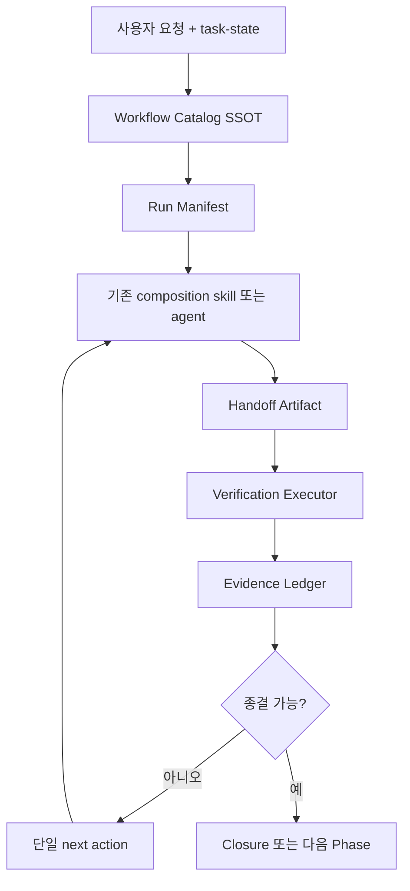

# Paperthin·Polysona 분석과 Composition Agent 자동화 적용안

> 분석일: 2026-08-27  
> 대상: [LilMGenius/paperthin](https://github.com/LilMGenius/paperthin), [LilMGenius/polysona](https://github.com/LilMGenius/polysona)  
> 목적: 두 저장소의 agentic pattern을 분석하고 composition 개발 자동화에 적용할 수 있는 구조와 도입 순서를 제안한다.  
> 문서 성격: 구현 전 조사·설계 제안. 이 문서 자체는 신규 ADR이나 구현 착수를 승인하지 않는다.
> 짝 문서: [Claude Code 측 분석·대조·병합 순서](./2026-08-27-paperthin-polysona-claude-analysis.md) — 두 분석의 상충 판정과 최종 실행 순서는 그 문서 §5·§6 이 기준이고, 이 문서는 상세 근거 문서로 유지한다 (2026-08-27 Codex 확인).

## 1. 결론

두 저장소를 그대로 composition에 설치하거나 이식하는 방식은 적절하지 않다.

- Paperthin에서 가져올 핵심은 **작업 단계별 작은 reflex와 catalog drift 방지**다.
- Polysona에서 가져올 핵심은 **전문 역할 간 artifact handoff와 저장 후 재검증**이다.
- composition에는 이미 두 저장소보다 강한 ADR, type-check, registration, live Builder 검증 체계가 있다.
- 따라서 필요한 것은 agent 수를 늘리는 일이 아니라, 기존 workflow를 **기계 판독 가능한 단일 실행 계약**으로 묶는 것이다.

가장 ROI가 높은 시작점은 다음 두 가지다.

1. 분산된 skill·route·roster 정보를 검증 가능한 workflow catalog SSOT로 통합한다.
2. 작업마다 machine-readable run manifest와 evidence ledger를 남긴다.

새 dashboard나 범용 자율 agent command surface는 이 두 단계가 효과를 증명한 뒤 검토해야 한다.

## 2. 분석 범위와 근거

분석은 2026-08-27 시점의 기본 브랜치를 기준으로 했다.

| 저장소    | 기본 브랜치 | 분석 SHA                                   | 분석한 주요 표면                                                                 |
| --------- | ----------- | ------------------------------------------ | -------------------------------------------------------------------------------- |
| Paperthin | `main`      | `3bca079a51bcfff5dafb53d1d7f9f523d66ee317` | README, CLAUDE.md, 28개 skill, validator, CI, commit history                     |
| Polysona  | `ralphthon` | `ad1f263801eb1e777a5ee89e0a034688bc6bfbd9` | README, AGENTS.md, agent/skill 정의, hook, server API, dashboard, commit history |

Ralphthon 관련 공개 근거는 다음처럼 구분했다.

- [Ralphthon Seoul #2 공식 행사 페이지](https://luma.com/v68q8un9)는 OpenAI 후원, long-running agent 중심 형식, 노트북 개입 제한 규칙을 확인하는 근거다.
- [Polysona 제작자의 우승 기록](https://kr.linkedin.com/posts/lilmgenius_%EC%B2%9C%ED%95%98%EC%A0%9C%EC%9D%BC-ai-%EB%8B%A4%EB%A4%B8%EA%B2%A8%EB%A3%A8%EA%B8%B0-%EB%8C%80%ED%9A%8C-%EC%9A%B0%EC%8A%B9%ED%95%9C-ssultxt-2026%EB%85%84-3%EC%9B%94-activity-7445243631172739072-wTGx)은 Polysona 우승과 최초 실행 이후 노트북 0회 조작 주장을 담고 있으며, 게시물에는 심사 관계자의 확인성 댓글이 있다.
- 기본 브랜치의 Git 이력은 약 11시간 동안 동일 작성자 이름으로 45개 commit이 생성된 사실을 보여준다. 다만 공개 저장소에는 agent transcript나 서명된 provenance가 없으므로, Git만으로 0회 개입을 독립 증명할 수는 없다.

## 3. 두 저장소의 본질

| 저장소    | 본질                                              | 자동화 단위                 | 가장 강한 패턴                              | 주된 한계                  |
| --------- | ------------------------------------------------- | --------------------------- | ------------------------------------------- | -------------------------- |
| Paperthin | agent용 저수준 작업 규율 라이브러리               | 하나의 판단·검증 reflex     | uniform skill 계약, SSOT, 검증·재시작 loop  | prompt 준수에 의존         |
| Polysona  | 여러 전문 agent가 artifact를 넘기는 제품 pipeline | 한 단계의 입력→출력 handoff | role 분리, context preload, Write→Read 확인 | 테스트·CI·실제 측정이 약함 |

Paperthin은 **agent가 어떻게 판단하고 검증할지**를 제품화했다. Polysona는 **전문 agent가 어떤 순서로 무엇을 넘길지**를 제품화했다. Composition에는 두 관점을 결합하되, 기존 production gate를 우선해야 한다.

## 4. Paperthin 심층 분석

### 4.1 구조

Paperthin은 애플리케이션이 아니라 Markdown skill 28개를 배포하는 저장소다. 작업을 artifact 개수와 반복 시간이라는 두 축으로 분류한다.

| 분류      | 의미                                  | composition 대응                             |
| --------- | ------------------------------------- | -------------------------------------------- |
| `depth`   | 하나의 artifact를 지금 정제·검증      | 한 구현, 문서, 결정의 focused review         |
| `breadth` | 여러 artifact 사이의 한 사실을 정합화 | catalog, CSS, Skia, Preview, ADR의 SSOT 확인 |
| `coil`    | 반복 cycle 사이에 학습을 전달         | ADR Phase와 세션을 넘는 구현·검증 loop       |
| `mesh`    | 여러 독립 관점을 수렴                 | 사용자가 명시한 multi-lens review            |

이 분류의 장점은 agent 이름이나 기술 stack이 아니라 **작업의 모양**을 기준으로 routing한다는 점이다.

### 4.2 Uniform skill contract

모든 skill은 다음 구조를 공유한다.

```text
Goal → Workflow → Rules → Verification
```

[`scripts/validate-skills.sh`](https://github.com/LilMGenius/paperthin/blob/3bca079a51bcfff5dafb53d1d7f9f523d66ee317/scripts/validate-skills.sh)는 다음을 CI에서 검사한다.

- frontmatter와 description 존재
- skill 이름과 directory 이름 일치
- 필수 section 존재
- plugin manifest 등록
- README catalog 노출
- plugin의 모든 경로가 실제 `SKILL.md`로 해석되는지 확인

[`scripts/check-skill-refs.sh`](https://github.com/LilMGenius/paperthin/blob/3bca079a51bcfff5dafb53d1d7f9f523d66ee317/scripts/check-skill-refs.sh)는 skill 이름 typo와 orphan skill을 찾고, [`scripts/check-catalog-sync.cjs`](https://github.com/LilMGenius/paperthin/blob/3bca079a51bcfff5dafb53d1d7f9f523d66ee317/scripts/check-catalog-sync.cjs)는 물리적으로 단일화하기 어려운 catalog 사본의 집합이 일치하는지 검사한다.

핵심은 모든 중복을 반드시 생성물로 바꾸는 것이 아니다. host·배포 경계 때문에 복제가 불가피하다면 **drift를 CI에서 차단**한다.

### 4.3 Invocation authority 분리

Paperthin은 model-invoked와 user-invoked를 구분한다. commit, release, merge, 다중 관점처럼 비용이나 외부 상태 변경을 수반하는 행동은 agent가 자의적으로 호출하지 못하게 한다.

[`docs/invocation.md`](https://github.com/LilMGenius/paperthin/blob/3bca079a51bcfff5dafb53d1d7f9f523d66ee317/docs/invocation.md)의 핵심 기준은 다음과 같다.

- agent가 자율적으로 사용해도 안전한 reflex는 model-invoked다.
- 인간의 명시적 결정이 필요한 작업은 user-invoked다.
- user-invoked skill은 model-facing trigger를 갖지 않는다.
- orchestrator는 설치된 model-invoked skill만 조합하며, 없는 skill은 명시적으로 skip한다.

이 패턴은 composition의 ADR 착수 제한, destructive action 승인, parallel/subagent 명시 요청 정책과 잘 맞는다.

### 4.4 `re0-loop`: 반복이 아니라 학습 loop

[`re0-loop`](https://github.com/LilMGenius/paperthin/blob/3bca079a51bcfff5dafb53d1d7f9f523d66ee317/skills/coil/re0-loop/SKILL.md)는 다음 순서를 갖는다.

```text
FRAME → BUILD → 실제 surface 검증 → MEMO → 적대적 검토 → 필요 시 재시작
```

중요한 원칙은 다음과 같다.

- 테스트만 통과하는 것을 완료로 보지 않는다.
- web은 browser, API는 HTTP처럼 실제 surface를 직접 exercise한다.
- 실패한 구현도 negative corpus로 보존한다.
- 다음 cycle은 이전 코드를 보존하는 것이 아니라, 증명된 lesson과 gate를 보존한다.
- 외부 truth가 유입되지 않는 내부 반복은 중단한다.

Composition의 `execute-adr`도 focused test, type-check, cross-check, live Builder exercise를 요구한다. 따라서 새로운 loop를 만드는 것보다 `execute-adr` 결과를 machine-readable evidence로 남기는 쪽이 적합하다.

### 4.5 `ssotize`: audit와 mutation 분리

[`ssotize`](https://github.com/LilMGenius/paperthin/blob/3bca079a51bcfff5dafb53d1d7f9f523d66ee317/skills/breadth/ssotize/SKILL.md)는 다음 순서를 강제한다.

1. 한 번에 하나의 truth를 정한다.
2. read-only audit로 모든 occurrence를 수집한다.
3. 다른 검색 방법으로 누락을 재확인한다.
4. copy, paraphrase, partial, stale, contradiction으로 분류한다.
5. canonical home과 mutation plan을 제시한다.
6. 승인 후에만 통합한다.

이는 composition의 catalog/theme SSOT, DOM·Skia consumer 대칭, ADR 상태·README·CHANGELOG 정합성에 직접 적용할 수 있다.

### 4.6 `sip`: 완료 직전 recursive verification

[`sip`](https://github.com/LilMGenius/paperthin/blob/3bca079a51bcfff5dafb53d1d7f9f523d66ee317/skills/depth/sip/SKILL.md)은 다음 검증을 조합한다.

- fresh-context cold read
- 외부 사실 검증
- SSOT audit
- portability claim 검사
- clean-v0 cleanup

Composition에서는 이를 별도 skill로 복사하기보다 `/review`, reviewer, evaluator, `codex:preflight`를 하나의 completion protocol로 묶는 참고 모델로 쓰는 편이 낫다.

### 4.7 그대로 도입하면 안 되는 부분

- Prompt skill은 실행 보장이 아니다. Static validator도 structure와 reference를 검증할 뿐 의미적 정확성을 보장하지 않는다.
- `re0`의 전면 rewrite는 성숙한 production code에 과격하다. composition의 좁은 diff와 요청 연결 원칙이 우선한다.
- `shower`, `prism`, `autobahn`은 fresh subagent를 전제한다. composition은 사용자가 병렬·subagent를 명시한 경우에만 별도 agent를 사용한다.
- 전체 catalog의 global wildcard 설치는 composition skill canonical과 보호된 전역 설정을 오염시킬 수 있다.
- 필요한 pattern만 project-local로 재구현하고, upstream prompt나 code를 직접 복사하면 MIT license와 NOTICE 요구를 확인해야 한다.

## 5. Polysona 심층 분석

### 5.1 Pipeline 구조

Polysona는 setup과 반복 loop로 구성된다.

```text
SETUP
profiler → persona.md + nuance.md + accounts.md

REPEAT
trendsetter → content-writer → virtual-follower QA
→ 사용자 선택 → admin → published artifact
```

각 단계는 user-facing skill과 전문 agent specification으로 분리된다.

- [`AGENTS.md`](https://github.com/LilMGenius/polysona/blob/ad1f263801eb1e777a5ee89e0a034688bc6bfbd9/AGENTS.md): 전체 agent catalog와 실행 흐름
- [`skills/`](https://github.com/LilMGenius/polysona/tree/ad1f263801eb1e777a5ee89e0a034688bc6bfbd9/skills): 사용자 명령과 입력 준비
- [`agents/`](https://github.com/LilMGenius/polysona/tree/ad1f263801eb1e777a5ee89e0a034688bc6bfbd9/agents): 각 역할의 책임, tool, output contract

### 5.2 Artifact handoff contract

Polysona의 가장 좋은 부분은 production agent가 같은 handoff 계약을 반복한다는 점이다.

1. 필요한 context 파일을 먼저 읽는다.
2. 자신의 단계만 수행한다.
3. 정해진 경로에 artifact를 저장한다.
4. 저장한 파일을 즉시 다시 읽는다.
5. 실제 파일이 확인된 뒤에만 성공을 보고한다.
6. 다음 agent는 그 파일을 입력으로 소비한다.

예를 들어 [`agents/content-writer.md`](https://github.com/LilMGenius/polysona/blob/ad1f263801eb1e777a5ee89e0a034688bc6bfbd9/agents/content-writer.md)는 draft를 `content/drafts/`에 저장한 뒤 다시 읽어야 한다. [`skills/qa/SKILL.md`](https://github.com/LilMGenius/polysona/blob/ad1f263801eb1e777a5ee89e0a034688bc6bfbd9/skills/qa/SKILL.md)는 실제 draft가 없으면 QA를 생성하지 않고 blocked 상태를 보고한다.

이 구조는 agent의 성공 주장보다 artifact 존재를 신뢰한다. Composition에는 다음처럼 강화해 적용할 수 있다.

```text
파일 존재 확인
→ diff 재확인
→ compile/test
→ 실제 UI exercise
→ evidence 기록
```

### 5.3 Context preload

Polysona는 작업 종류별 필수 입력 파일을 미리 정한다.

- interview: persona와 최신 interview-log
- content: persona, nuance, accounts, 선택된 trend
- QA: 실제 draft와 audience data
- publish: 최종 선택 draft와 account mapping

장점은 agent가 repository 전체를 읽지 않고도 필요한 context를 안정적으로 확보하는 것이다. Composition의 `composition-patterns`, 관련 rule 1~3개, 대상 ADR, 변경 파일 기반 snapshot 원칙과 같은 방향이다.

### 5.4 Evaluation context 격리

Virtual follower QA는 `context: fork`를 사용한다. 생성 agent의 판단 과정을 평가자가 그대로 합리화하지 못하게 하는 구조다.

Composition에서는 자동 fork가 아니라 다음 경계로 적용해야 한다.

- 기본 실행은 현재 main agent가 담당한다.
- 사용자가 `/review`, 병렬 검증, subagent를 명시했을 때만 fresh reviewer/evaluator를 사용한다.
- fresh reviewer에는 의도와 session reasoning이 아니라 검토 대상 artifact와 contract만 전달한다.

### 5.5 Commit 이력에서 보이는 실행 특성

기본 브랜치에는 약 11시간 동안 45개 commit이 있다.

| 유형    |  수 |
| ------- | --: |
| `feat`  |  19 |
| `fix`   |  15 |
| `docs`  |   5 |
| `merge` |   3 |
| `chore` |   3 |

이 이력은 agent가 빠르게 vertical slice를 만들고, integration defect를 연속해서 복구하는 형태를 보여준다. 동시에 `fix` 비율이 높다는 사실은 빠른 실행이 강점이지만 사전 gate가 충분하지 않았다는 신호이기도 하다.

### 5.6 기술적 한계

Polysona를 production 자동화 표본으로 사용할 때는 다음 한계를 분리해야 한다.

1. [`package.json`](https://github.com/LilMGenius/polysona/blob/ad1f263801eb1e777a5ee89e0a034688bc6bfbd9/package.json)에 test, lint, type-check, CI gate가 없다. `build`가 사실상 유일한 코드 검증이다.
2. [`server/routes/api.ts`](https://github.com/LilMGenius/polysona/blob/ad1f263801eb1e777a5ee89e0a034688bc6bfbd9/server/routes/api.ts)의 dashboard QA 점수는 실제 draft 의미 평가가 아니라 persona, follower, dimension, 파일명을 해시한 결정적 숫자다.
3. `CLAUDE.md`는 `.ref/PLAN_FOR_POLYSONA.md`를 필수 context로 지목하지만 `.ref/`는 gitignore되어 기본 브랜치에 없다.
4. README는 `.agents/skills`가 mirror되어 있다고 설명하지만 기본 브랜치 tree에는 `.agents/`가 없다. 사용자가 sync script를 별도로 실행해야 한다.
5. publish 단계는 외부 플랫폼 게시가 아니라 `ready-to-post` 파일과 checklist 생성까지다.
6. SessionStart와 PreToolUse hook은 유용하지만 persona overwrite를 차단하지 않고 경고만 한다.
7. dashboard status와 skill status가 서로 다른 directory와 지표를 읽어, 관측 surface 자체가 하나의 SSOT로 정리되지 않았다.

따라서 Polysona 우승에서 composition이 배워야 할 것은 ship quality bar가 아니라, agent가 장시간 작업을 끝까지 연결하는 harness shape다.

## 6. Composition 현행 구조와 격차

Composition은 이미 다음 기반을 갖고 있다.

- 공용 목표, 보호, 중단 기준: `.agent/task-state.json`
- skill·agent routing과 lifecycle hook
- 단계형 ADR 실행: `.claude/skills/execute-adr/SKILL.md`
- 변경 감지형 `codex:preflight`
- focused Vitest, type-check, registration contract
- rendering·wiring·schema 변경의 실제 Builder exercise 의무
- ADR-195 runtime command execution registry
- git log 기반 fix/revert 관측

즉 agentic workflow를 새로 만드는 단계가 아니다. 현재 자동화 격차는 다음 세 가지다.

### 6.1 Workflow catalog 분산

같은 routing 사실이 여러 파일에 복제돼 있다.

- `.claude/hooks/route-prompt.sh`
- `scripts/codex/route-prompt.sh`
- SessionStart workflow roster
- `.claude/skills/INDEX.md`
- `.agents/skills/INDEX.md`

Host별 표현이 달라 물리적 single source가 어려울 수 있지만, 적어도 manifest 생성 또는 drift gate가 필요하다.

### 6.2 Skill catalog drift

`.agents/skills/INDEX.md`는 8개 core skill을 나열하지만 실제 `.agents/skills/`에는 `execute-adr`, `match-target`, `source-command-review`를 포함해 11개 skill directory가 있다.

이는 Paperthin식 validator가 바로 잡을 수 있는 유형이다. Symlink target, INDEX entry, SessionStart roster, route trigger가 하나라도 누락되면 preflight 또는 별도 catalog gate에서 실패시켜야 한다.

### 6.3 Run 단위 evidence SSOT 부재

검증 자체는 강하지만 결과가 여러 표면에 흩어진다.

- focused Vitest output
- package type-check output
- `codex:preflight` output
- browser/live exercise 설명과 screenshot
- ADR phase log
- 대화의 완료 보고

다음 세션은 어떤 명령이 언제 어떤 exit code로 통과했는지 다시 구성해야 한다. Polysona의 artifact handoff를 이 지점에 적용하는 것이 가장 효과적이다.

## 7. 권장 목표 구조



각 layer의 책임은 다음과 같이 분리한다.

| Layer            | 책임                                          | 정본으로 두지 않을 것 |
| ---------------- | --------------------------------------------- | --------------------- |
| task-state       | 현재 사용자 계약: goal, guard, stop, next     | 세부 command output   |
| ADR              | architecture decision, risk, phase contract   | 세션별 실행 로그 전체 |
| Workflow Catalog | trigger, skill, role, approval, gate mapping  | 사용자별 현재 상태    |
| Run Manifest     | 이번 실행의 해석, scope, phase, inputs        | architecture truth    |
| Evidence Ledger  | 실제 command, exit code, artifact, live proof | agent의 자기평가      |
| code/test        | 제품 동작과 회귀 계약                         | workflow 설명 복제    |

## 8. 적용 우선순위

### P0 — Agent catalog drift gate

가장 먼저 구현할 가치가 있다.

- `.claude/skills`를 skill canonical catalog로 읽는다.
- `.agents/skills` symlink와 target 존재를 검사한다.
- `.claude/skills/INDEX.md`, `.agents/skills/INDEX.md`, SessionStart roster, prompt router의 등록 누락을 검사한다.
- 잘못된 frontmatter, broken reference, orphan skill을 검출한다.
- `pnpm run codex:agent-catalog` 같은 단일 command를 제공한다.
- 안정화 후 `codex:preflight`에 포함한다.

Paperthin의 validator를 복사하기보다 composition의 symlink canonical, 한국어 trigger, user-invoked 경계에 맞게 재구현해야 한다.

### P1 — Run manifest와 evidence ledger

Local-only 경로인 `.agent/runs/<run-id>/`가 적합하다.

```text
.agent/runs/<run-id>/
├── run.json
├── evidence.jsonl
└── artifacts/
```

`run.json`은 다음 정도만 담는다.

- `understoodAs`: 요청 해석
- `scope.include`, `scope.exclude`
- 선택된 skill과 role
- 현재 phase와 상태
- required gates
- live scenario
- 남은 uncertainty와 residual risk

`evidence.jsonl`은 append-only로 다음 사실을 기록한다.

- 실행 command와 working directory
- 시작·종료 시각
- exit code
- 대상 package/test
- output artifact 또는 screenshot 경로
- pass, fail, skipped와 skip reason
- 실패로 추가된 regression gate

기존 `.agent/task-state.json`의 `goal`, `guard`, `stop`은 복제하거나 자동 변경하지 않는다. Run manifest는 현재 계약을 read-only snapshot으로 참조한다.

### P2 — Evidence 기반 workflow runner

`codex:harness`를 다음 실행 표면으로 확장할 수 있다.

```text
work start
work status
work verify
work resume
work close
```

`work verify`는 changed-file scope와 manifest에 따라 다음을 선택한다.

1. focused Vitest
2. 변경 package type-check
3. `codex:preflight`
4. 필요 시 `cross-check`
5. 사용자-visible 또는 wiring/schema 변경의 live Builder exercise

모든 결과는 terminal에만 출력하지 않고 evidence ledger에 기록한다. 완료 보고는 이 ledger에서 생성한다.

### P3 — 실패를 negative corpus와 gate로 전환

Composition에는 이미 fix/revert scope 통계와 ADR drift metric이 있다. 다음 단계는 실패를 prose memory로만 남기지 않고 재발 방지 gate와 연결하는 것이다.

권장 record는 다음 필드를 가진다.

- failure signature
- affected scope
- root cause
- reproducing fixture
- gate or test added
- fixed commit
- recurrence count

모든 실패를 저장할 필요는 없다. 반복되거나 영향이 큰 failure class만 기록하고, 가능한 경우 정본은 regression test로 승격한다.

### P4 — ADR-195 기반 제한적 agent command surface

ADR-195의 runtime registry를 agent가 직접 호출하게 만드는 것은 아직 이르다. 현재 handler는 mounted React closure와 focus scope에 의존하므로 headless automation API가 아니다.

후속 설계에서는 다음을 분리해야 한다.

- 공통 metadata: `id`, precondition, mutation scope, undo 가능 여부
- UI adapter: 현재 runtime handler
- agent adapter: domain/store action
- 기본값: `agentCallable: false`
- 안전한 command만 명시적 allowlist
- destructive, DB, publish command는 사용자 승인 필수
- 실행 결과와 undo 여부를 evidence ledger에 기록

이는 별도 architecture decision이 필요한 범위다. 이 조사 문서는 ADR 착수 권한을 의미하지 않는다.

### P5 — 관측 UI는 마지막

Polysona식 dashboard는 바로 만들 필요가 없다. 먼저 CLI status와 evidence ledger가 실제 운영에 유용한지 검증해야 한다.

표시할 가치가 있는 지표는 다음과 같다.

- 실행 중 phase와 허용 scope
- gate별 마지막 실행 시각과 exit code
- targeted test와 live exercise 존재 여부
- 반복 fix scope와 regression test 동반률
- workflow catalog drift 수
- gate false-positive와 escape 비율

파일명 hash나 agent가 자체 생성한 품질 점수는 표시하지 않는다. Observer는 evidence의 consumer여야 하며 새로운 truth를 만들면 안 된다.

## 9. 도입하지 말아야 할 것

- Paperthin 전체를 global wildcard로 설치
- PLOON Markdown이나 Git을 CompositionDocument·DB 대신 runtime SSOT로 사용
- agent 수, LOC, commit 수를 자동화 성공 KPI로 사용
- 실제 검증 없는 synthetic dashboard score
- runtime `commandRegistry` handler를 그대로 headless API로 노출
- 사용자 명시 없이 fresh subagent나 병렬 reviewer 자동 실행
- `re0` 철학으로 production code를 전면 재작성
- task-state, ADR, run manifest에 같은 사실을 독립 복제
- verification 실패를 agent 요약문만으로 덮고 raw exit code와 artifact를 버리는 방식

## 10. 성공 지표

자동화 효과는 생성량보다 재작업과 검증 완결성으로 측정한다.

| 지표                                          | 목표 방향        |
| --------------------------------------------- | ---------------- |
| Skill·route·roster catalog drift              | 0                |
| 완료 run의 required evidence 충족률           | 증가             |
| live behavior가 필요한 변경의 exercise 기록률 | 증가             |
| 동일 root-cause fix 재발률                    | 감소             |
| regression test 미동반 반복 fix scope         | 감소             |
| gate false-positive·escape 비율               | 안정화 또는 감소 |
| 세션 resume 시 context 재구성 시간            | 감소             |
| 완료 선언 후 재오픈되는 작업 비율             | 감소             |

## 11. 최종 권고

Composition에 필요한 것은 Polysona처럼 agent를 다섯 개로 늘리는 일이 아니다. 이미 존재하는 skill, ADR phase, reviewer, evaluator, preflight를 다음 세 가지로 연결하는 것이 핵심이다.

1. **Workflow Catalog SSOT**: 어떤 요청이 어떤 skill·role·gate로 가는지 한 곳에서 판정한다.
2. **Artifact Handoff**: 단계의 결과를 대화가 아니라 file, diff, fixture, screenshot으로 넘긴다.
3. **Evidence Closure**: 실제 command와 live exercise가 확인된 경우에만 완료를 선언한다.

착수 순서는 P0 catalog drift gate → P1 run/evidence schema → P2 workflow runner가 적절하다. P4 command surface와 P5 dashboard는 앞선 단계에서 실제 자동화 효과가 측정된 뒤 별도 설계·승인을 거쳐야 한다.

## 12. 주요 소스

### Paperthin

- [Repository](https://github.com/LilMGenius/paperthin)
- [README](https://github.com/LilMGenius/paperthin/blob/3bca079a51bcfff5dafb53d1d7f9f523d66ee317/README.md)
- [CLAUDE.md](https://github.com/LilMGenius/paperthin/blob/3bca079a51bcfff5dafb53d1d7f9f523d66ee317/CLAUDE.md)
- [Invocation contract](https://github.com/LilMGenius/paperthin/blob/3bca079a51bcfff5dafb53d1d7f9f523d66ee317/docs/invocation.md)
- [re0-loop](https://github.com/LilMGenius/paperthin/blob/3bca079a51bcfff5dafb53d1d7f9f523d66ee317/skills/coil/re0-loop/SKILL.md)
- [ssotize](https://github.com/LilMGenius/paperthin/blob/3bca079a51bcfff5dafb53d1d7f9f523d66ee317/skills/breadth/ssotize/SKILL.md)
- [sip](https://github.com/LilMGenius/paperthin/blob/3bca079a51bcfff5dafb53d1d7f9f523d66ee317/skills/depth/sip/SKILL.md)
- [CI validator](https://github.com/LilMGenius/paperthin/blob/3bca079a51bcfff5dafb53d1d7f9f523d66ee317/.github/workflows/ci.yml)

### Polysona

- [Repository](https://github.com/LilMGenius/polysona)
- [README.ko.md](https://github.com/LilMGenius/polysona/blob/ad1f263801eb1e777a5ee89e0a034688bc6bfbd9/README.ko.md)
- [AGENTS.md](https://github.com/LilMGenius/polysona/blob/ad1f263801eb1e777a5ee89e0a034688bc6bfbd9/AGENTS.md)
- [Agent definitions](https://github.com/LilMGenius/polysona/tree/ad1f263801eb1e777a5ee89e0a034688bc6bfbd9/agents)
- [Skill definitions](https://github.com/LilMGenius/polysona/tree/ad1f263801eb1e777a5ee89e0a034688bc6bfbd9/skills)
- [Lifecycle hooks](https://github.com/LilMGenius/polysona/tree/ad1f263801eb1e777a5ee89e0a034688bc6bfbd9/hooks)
- [PLOON parser](https://github.com/LilMGenius/polysona/blob/ad1f263801eb1e777a5ee89e0a034688bc6bfbd9/server/lib/ploon.ts)
- [Dashboard API](https://github.com/LilMGenius/polysona/blob/ad1f263801eb1e777a5ee89e0a034688bc6bfbd9/server/routes/api.ts)
- [Commit history](https://github.com/LilMGenius/polysona/commits/ralphthon)

### Ralphthon

- [Ralphthon Seoul #2 — official event page](https://luma.com/v68q8un9)
- [Polysona winner report](https://kr.linkedin.com/posts/lilmgenius_%EC%B2%9C%ED%95%98%EC%A0%9C%EC%9D%BC-ai-%EB%8B%A4%EB%A4%B8%EA%B2%A8%EB%A3%A8%EA%B8%B0-%EB%8C%80%ED%9A%8C-%EC%9A%B0%EC%8A%B9%ED%95%9C-ssultxt-2026%EB%85%84-3%EC%9B%94-activity-7445243631172739072-wTGx)
