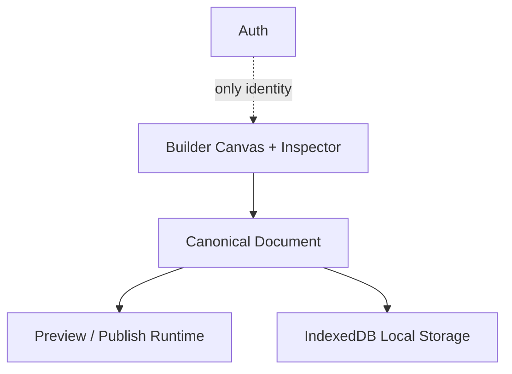
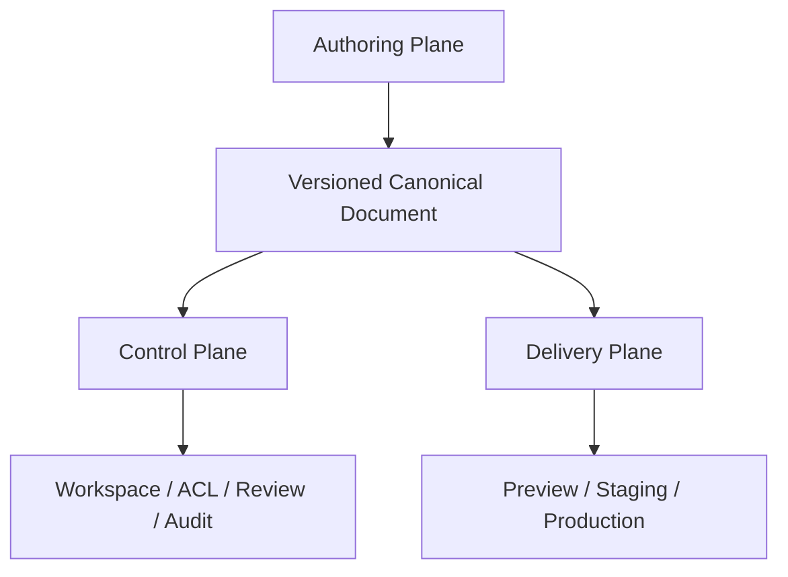

# rblood79/composition 엔터프라이즈급 사이트 빌더 보완 리포트

작성일: 2026-07-16  
대상: [rblood79/composition](https://github.com/rblood79/composition) `main`  
목적: 대규모 엔터프라이즈 사이트 설계·운영을 목표로 할 때 현재 구조의 강점, 경쟁 도구 대비 격차, 보완 우선순위와 착수 순서를 정의

## 1. 기술 요약

### 결론

`composition`은 현재 **고급 렌더링·레이아웃·컴포넌트 편집 엔진**으로서는 상당한 기반을 갖추고 있지만, 아직 **엔터프라이즈 사이트 플랫폼**으로 완결된 상태는 아니다.

가장 큰 문제는 컴포넌트 수나 Canvas 효과의 부족이 아니다. 현재 제품을 막는 핵심 격차는 다음 네 가지다.

1. 프로젝트가 인증 사용자 브라우저의 IndexedDB에 머물러 있어 조직·권한·공유·동시 편집이 없다.
2. Publish가 사이트 배포 플랫폼이 아니라 JSON 프로젝트를 로드하는 런타임에 가깝다.
3. 반응형 breakpoint 타입과 CSS 생성기는 있지만 실제 편집 표면과 canonical 문서에 아직 연결되지 않았다.
4. Builder에서 가능한 데이터·이벤트·AI 동작이 Publish 런타임과 보안 경계를 완성하지 못했다.

따라서 현재의 제품 포지션은 다음이 가장 정확하다.

> **React Aria 기반의 코드 인지형 visual application builder kernel**

목표가 Webflow·Framer·Builder.io·Plasmic과 경쟁하는 대규모 사이트 설계 도구라면, 다음 단계는 “렌더링 parity 추가”가 아니라 **Authoring plane + Control plane + Delivery plane**을 제품 수준으로 묶는 것이다.

### 강점

- React Aria 기반 DOM Preview/Publish와 Skia 기반 편집 Canvas를 분리한 구조
- Rust/WASM 레이아웃·공간 인덱스·컬링 경로를 보유
- canonical document, component instance/origin, slot, descendant override의 방향성
- 다중 페이지·이벤트/액션·데이터 바인딩·DataTable의 기반
- AI tool-calling agent loop와 컴포넌트 CRUD 도구
- JSON export/import, IndexedDB persistence, undo/redo, 백업 guard
- 렌더러와 CSS/카탈로그 간 parity를 계약 테스트로 관리하려는 강한 engineering discipline

### 기업용 출시를 차단하는 영역

| 영역 | 현재 상태 | 판정 |
|---|---|---|
| 편집 엔진 | 강함. Skia/WASM, selection, layout, component catalog 기반 | 경쟁력 있음 |
| 디자인 저작 표면 | 부분 지원. 엔진에 있는 grid/effects/transform 중 다수가 Inspector에 노출되지 않음 | HIGH |
| 반응형 저작 | `responsive.types.ts`와 생성기는 있으나 breakpoint 스위처·canonical 저장·실제 소비 경로가 미완성 | CRITICAL |
| 데이터/CMS | DataTable·REST·mock 기반. collection binding 경로가 여러 개이고 Publish 소비가 불완전 | HIGH |
| 협업/권한 | 인증 + 로컬 IndexedDB. workspace/project membership, presence, comments, ACL 부재 | CRITICAL |
| Publish/Hosting | JSON viewer와 JS runtime 중심. custom domain/CDN/atomic release/rollback/SEO pipeline 부재 | CRITICAL |
| 보안 | `new Function`, browser-side Groq SDK, 개발용 범용 proxy가 존재 | CRITICAL |
| 운영 품질 | type-error baseline 67개, 배포 workflow가 builder build 중심 | HIGH |

## 2. 현재 구조와 목표 구조

현재는 아래처럼 편집기와 로컬 문서가 중심이다.



엔터프라이즈 사이트 제품에서는 다음 세 plane이 분리되어야 한다.



- **Authoring plane**: Canvas, Inspector, component/slot, responsive, interaction authoring
- **Control plane**: organization, workspace, project, document, version, branch, asset, locale, CMS, permissions, comments, audit
- **Delivery plane**: canonical document compile, HTML/CSS/runtime artifact, preview, staging, production, domain/CDN, rollback, release observability

현재 저장소는 Authoring plane의 저수준 기반은 많이 갖췄지만 Control plane과 Delivery plane이 거의 비어 있다.

## 3. 외부 도구와 비교

외부 기능은 2026-07-16 기준 각 제품의 공식 문서를 기준으로 비교했다. 기능의 존재 여부를 비교한 것이며, 각 제품의 실제 품질·가격·계약 조건을 평가한 것은 아니다.

| 기준 | composition | Webflow | Framer | Builder.io | Plasmic | GrapesJS |
|---|---|---|---|---|---|---|
| 시각 편집 | Custom Skia Canvas와 DOM Preview의 이중 파이프라인. 저수준 엔진은 강하지만 Inspector 노출이 좁음 | 성숙한 CSS/반응형 시각 편집 | 디자인·마케팅 사이트 저작 경험이 강함 | Visual CMS와 codebase 편집 결합 | 코드 컴포넌트와 visual studio 결합 | Embeddable builder kernel |
| 반응형 | 타입/생성기 기반은 있으나 authoring wiring 미완성 | breakpoint, reflow, variable mode | breakpoint와 responsive editing | visual editor 기반 responsive authoring | 여러 화면 크기 동시 설계 | Style/Responsive 확장 가능 |
| 컴포넌트/DS | catalog, slots, instance override 기반이 강함. 사용자 정의 variant/property와 team library는 약함 | components, variables, libraries | components, team library | custom components, data models, design system indexing | code components, variants, slots, prop controls | component types, traits, blocks, plugins |
| CMS/데이터 | DataTable/REST/mock. collection 계약과 Publish 소비 통합이 미완성 | structured CMS, collection templates, API | CMS와 content editor | models, data binding, live preview, A/B, scheduling | built-in CMS와 headless/codebase 연결 | 외부 host가 storage/CMS를 구성 |
| 협업/권한 | 인증만. local-only document | workspace/site roles, custom roles, granular access, activity log | workspace/project roles, content editor, deploy permission | environment permissions, request-to-publish, workflows, activity log | multiplayer, branching, approvals | 기본적으로 host 애플리케이션 책임 |
| 버전/배포 | page history/undo는 있으나 named version, staging, production release 없음 | staging, page branching, backups, custom hosting | immutable published versions, staging, rollback | environments와 publish workflow | branching/version control/codegen | project JSON + storage manager, 배포는 host 책임 |
| SEO/운영 | title/viewport 중심 static HTML. meta/OG/sitemap/robots/@media pipeline 부족 | SEO와 hosting이 제품 범위에 포함 | publish 전 최적화 검사와 hosting 제공 | composable CMS/production integration | codebase/hosting과 결합 | host가 직접 구현 |
| 차별화 포인트 | 접근성 친화 DOM + 자체 렌더/레이아웃 + 데이터/액션/AI 잠재력 | 가장 균형 잡힌 사이트 운영 모델 | 빠른 디자인·콘텐츠 제작 | CMS·환경·코드베이스·AI 협업 | code-first visual CMS | 확장 가능한 embeddable engine |

### 비교에서 가져와야 할 패턴

#### Webflow에서 가져올 것: site 운영 모델

Webflow는 workspace role과 site role을 분리하고, Enterprise에서는 CMS·locale·page 단위까지 granular access control을 제공한다. 또한 page branching, staging URL, backup restore, activity log가 사이트 운영 흐름에 포함되어 있다.

`composition`은 아래 개념을 명시적으로 도입해야 한다.

- Workspace / Site / Project의 계층
- Design / Content / Deploy / Admin 권한 분리
- 페이지·locale·collection 단위 ACL
- branch → review → staging → production 흐름
- backup과 activity log

#### Framer에서 가져올 것: release UX

Framer는 published version을 immutable하게 만들고, staging과 production을 분리하며, 특정 version을 다시 deploy하거나 rollback할 수 있다. Content Editor처럼 디자인 전체 권한 없이 CMS·localization만 관리하는 역할도 분리한다.

`composition`의 Publish 버튼은 단순 JSON export가 아니라 **Release 생성**이어야 한다.

#### Builder.io에서 가져올 것: environment와 governance

Builder.io는 environment별로 link/push/request 권한을 나누고, request-to-publish와 content governance workflow를 제공한다. Data model, live preview, A/B test, scheduling도 Visual Editor에 연결한다.

`composition`은 API/데이터 패널을 먼저 늘리기보다 다음을 canonical 모델로 고정해야 한다.

```text
collectionId + fieldMap + query + environment + locale + previewSnapshot
```

#### Plasmic에서 가져올 것: code-first visual boundary

Plasmic은 code component를 visual studio에 등록하고 prop controls, slots, behaviors로 편집 표면을 구성한다. multiplayer와 branch를 분리해 동시 편집과 격리된 작업을 모두 지원한다.

`composition`의 component catalog는 이미 강한 편이므로, 다음을 외부 등록 계약으로 승격하는 것이 효율적이다.

- component manifest
- editable prop schema
- slot schema
- variant/property schema
- renderer/preview/publish capability
- version compatibility

#### GrapesJS에서 가져올 것: persistence boundary

GrapesJS는 HTML/CSS를 persistence source로 삼지 않고, editor가 이해하는 Project JSON을 canonical 저장 단위로 삼는다. Pages, Components, Traits, Blocks, Assets, Storage가 독립 모듈로 확장된다.

`composition`의 canonical document 방향은 이 원칙과 맞는다. 다만 현재 canonical store가 문서 자체의 history/undo/persistence와 완전히 통합되지 않았으므로, **canonical document를 유일한 저장·버전·배포 입력으로 확정하는 작업**이 남아 있다.

## 4. 우선순위별 보완 과제

### P0 — 엔터프라이즈 파일럿 전에 반드시 해결

| 과제 | 현재 근거 | 필요한 보완 | 완료 기준 |
|---|---|---|---|
| 1. Remote control plane | Supabase는 auth 중심이고 프로젝트는 IndexedDB local-only | 조직·workspace·project·membership·role·permission·document·release·audit schema와 API 도입. IndexedDB는 offline cache로 격하 | 두 사용자가 같은 프로젝트를 열고 권한에 따라 read/design/content/deploy가 차단됨 |
| 2. Canonical persistence 완결 | `canonicalDocumentStore`가 in-memory mutation skeleton이며 history/undo/persistence 미통합이라고 명시 | 모든 mutation을 versioned command/patch로 기록. optimistic concurrency, conflict detection, autosave, server snapshot, restore point 도입 | 브라우저 새로고침·다중 탭·동시 수정·복원에서 요소 유실과 silent overwrite가 없음 |
| 3. Release/hosting pipeline | `apps/publish`는 JSON runtime이며 static export도 JS runtime을 인라인하는 단일 HTML 중심 | Site manifest, build artifact, preview/staging/production environment, immutable release, custom domain/CDN/SSL, deploy webhook, rollback 설계 | 페이지별 HTML/CSS/asset/runtime을 staging에 배포하고 승인된 release만 production으로 승격 가능 |
| 4. SEO와 실제 responsive output | export에 title/viewport는 있으나 meta/OG/sitemap/robots/@media 경로가 부족 | page SEO model, canonical URL, OG/Twitter metadata, structured data, sitemap, robots, per-page HTML, CSS media query/SSR 또는 SSG 도입 | Lighthouse/검색 크롤러 관점에서 metadata·semantic HTML·mobile output이 검증됨 |
| 5. Breakpoint authoring | responsive 타입과 생성기는 있으나 스위처·canonical 저장·소비 경로가 미완성. ADR-154가 Proposed | desktop base + tablet/mobile override schema를 canonical에 배선. Inspector breakpoint switcher, dirty override, 단일 cascade resolver, Skia/Preview/Publish parity 테스트 | 대표 컴포넌트 3종 × breakpoint 3개에서 편집·Preview resize·Publish 결과가 동일함 |
| 6. Runtime security boundary | `useDataSource.ts`의 transform이 `new Function`을 사용하고, Vite 개발 proxy는 임의 target URL을 중계. AI 서비스는 browser SDK와 `dangerouslyAllowBrowser`를 사용 | 사용자 코드 제거 또는 제한 DSL/Worker sandbox. 외부 API는 server action gateway + secret vault + domain allowlist + rate limit. AI 호출은 server gateway로 이동 | production bundle에 secret이 없고 임의 코드·SSRF·임의 header forwarding이 불가능함 |
| 7. Release quality gate | `apps/builder/.type-errors-baseline.txt`에 67개 오류가 남아 있음. 배포 workflow는 builder build 중심 | type-error baseline을 새 오류 0 정책으로 전환하고, lint/test/e2e/visual parity/export smoke를 CI required check으로 승격 | PR에서 type, unit, browser smoke, publish artifact, migration test를 모두 통과해야 merge/deploy됨 |

### P1 — P0 이후 생산성과 확장성을 결정

| 과제 | 필요한 보완 |
|---|---|
| Collection/CMS 계약 단일화 | `collectionId + fieldMap + query + locale + environment`를 canonical binding으로 고정하고, Builder/Preview/Publish가 같은 resolver를 사용. 현재 Proposed인 ADR-152를 구현 단위로 삼되, 먼저 data model을 서버·버전·권한과 연결 |
| Publish runtime parity | Builder EventEngine의 액션 집합과 Publish `ActionExecutor`의 지원 범위를 동일 capability matrix로 관리. Publish에서 실패하는 action을 publish 전 오류로 표시 |
| Inspector surface 확장 | 엔진에 이미 있는 opacity, blend, blur/filter, clip-path, transform, per-corner radius, grid, position, responsive 속성을 UI로 노출. 저장만 되고 소비되지 않는 값은 제거하거나 명확히 `unsupported` 처리 |
| 사용자 디자인 시스템 | token CRUD, alias, mode, typography/color/effect style preset, component variant/property, project/team library를 서버 버전과 연결 |
| Asset/locale 관리 | 이미지·SVG·video·font asset library, metadata, transform, CDN URL, rights 정보, locale별 content variant, translation workflow 도입 |
| 협업 | presence, cursor, comments, mentions, review state, branch, merge, approval, read-only share link. 실시간 협업은 remote document와 conflict model 이후에 착수 |
| 접근성·품질 검사기 | React Aria 런타임 장점을 authoring-time lint로 확장: heading order, label association, contrast, keyboard path, alt text, focus visibility, landmark/semantic structure 검사 |
| 문서 상태 관리 | `PLANNED.md`와 `UNIMPLEMENTED.md`의 오래된 업데이트 날짜를 제거하고 capability registry를 코드/ADR/문서에서 자동 생성. Proposed/Accepted/Implemented/Partial의 기준을 CI에서 검증 |

### P2 — 제품 차별화와 고급 디자인 기능

- smart guides, rulers, manual guides, spacing measurement
- 사용자 정의 vector/pen/boolean/shape 도구
- motion timeline, scroll interaction, page transition, state machine UI
- A/B test, personalization, analytics, feature flag 연결
- plugin/API/SDK 생태계와 React code export
- texture, video fill, advanced mask, multi-stroke, 3D transform 등

이 항목들은 매력적이지만 P0/P1 전에 시작하면 현재와 같은 “렌더러는 진전되지만 제품 운영은 정체되는” 구조가 반복될 가능성이 높다.

## 5. 가장 중요한 구조적 리스크

### 5.1 이중 렌더러가 아니라 이중 계약이 문제다

Skia Canvas와 DOM Preview를 동시에 유지하는 것 자체는 문제가 아니다. 문제는 다음 세 경로가 서로 다른 계약을 소비할 수 있다는 점이다.

```text
Canonical Document
       ├── Skia layout/render
       ├── Preview DOM/runtime
       └── Publish DOM/runtime
```

각 기능은 다음 capability matrix를 가져야 한다.

| capability | canonical 저장 | Skia | Preview | Publish | Inspector | 테스트 |
|---|---:|---:|---:|---:|---:|---:|
| responsive width | yes/no | yes/no | yes/no | yes/no | yes/no | cross-runtime |
| data binding | yes/no | yes/no | yes/no | yes/no | yes/no | fixture |
| event/action | yes/no | yes/no | yes/no | yes/no | yes/no | execution |
| style effect | yes/no | yes/no | yes/no | yes/no | yes/no | visual |

“저장되지만 소비되지 않음”, “렌더되지만 편집 불가”, “Builder에서 실행되지만 Publish에서 실패”를 각각 제품 결함으로 추적해야 한다.

### 5.2 Local-first는 offline cache이지 enterprise source of truth가 아니다

IndexedDB는 빠른 편집과 offline recovery에 유용하다. 그러나 조직 단위 사이트 운영에서는 다음을 제공하지 못한다.

- 사용자 간 동일 문서 공유
- 권한 강제
- 중앙 backup과 audit
- branch/review/release
- 서버 측 secret과 data access control
- 브라우저·기기 분실 시 복구

권장 구조는 `server canonical snapshot + local optimistic cache + append-only mutation log`이다.

### 5.3 Event/Data/AI는 sandbox가 없으면 기업용 기능이 될 수 없다

현재 Builder 쪽은 기능이 풍부하지만, 외부 URL·API header·transform·custom function·AI tool을 모두 브라우저에서 실행하면 보안 경계가 무너진다. 특히 다음은 출시 전 차단해야 한다.

- 임의 `new Function` 실행
- secret이 포함될 수 있는 browser-side API call
- allowlist 없는 URL proxy/redirect
- `dangerouslyAllowBrowser` AI client
- tool call에 대한 tenant/project permission 검증 부재

## 6. 권장 착수 순서

### Phase 0 — 제품 계약 고정

먼저 다음 객체와 상태 전이를 문서·schema·API에 고정한다.

```text
Organization
  └─ Workspace
      └─ Site / Project
          ├─ Document / Page / Component
          ├─ Collection / Asset / Locale
          └─ Release
              ├─ Preview
              ├─ Staging
              └─ Production
```

각 객체에 `id`, `version`, `owner`, `createdAt`, `updatedAt`, `environment`, `permissions`를 갖게 한다. 이 계약이 없으면 기능마다 또 다른 store와 adapter가 생긴다.

### Phase 1 — persistence와 control plane

1. canonical document server schema/API
2. project membership와 RBAC/ABAC
3. patch log, optimistic concurrency, restore point
4. IndexedDB cache/queue와 reconnect recovery
5. audit event와 permission test fixture

### Phase 2 — responsive authoring과 publish

1. ADR-154의 breakpoint wiring
2. style cascade와 inline-style 충돌 해소
3. per-page HTML/CSS/runtime artifact
4. SEO/OG/sitemap/robots/structured data
5. preview/staging/production release와 rollback

### Phase 3 — CMS/data/security

1. ADR-152 collection binding 단일화
2. server action gateway와 secret vault
3. Publish capability parity
4. data cache/revalidation/error/permission model
5. content editor와 locale workflow

### Phase 4 — collaboration/design system

1. comments/presence/branch/review
2. token/variant/team library
3. asset library/CDN
4. accessibility/content quality gates
5. plugin/SDK/code integration

## 7. 완료 판정용 최소 acceptance criteria

엔터프라이즈 파일럿을 “가능”하다고 판단하려면 다음 시나리오를 실제 브라우저에서 통과해야 한다.

1. **조직 시나리오**: Admin, Designer, Content Editor, Reviewer, Viewer가 동일 사이트에 접속하고 각 작업 범위가 다르게 제한된다.
2. **문서 시나리오**: 두 탭에서 편집해도 version conflict가 조용히 덮어쓰기로 끝나지 않고 복구 가능하다.
3. **반응형 시나리오**: desktop에서 만든 페이지를 tablet/mobile override로 편집하고 Skia·Preview·Publish가 같은 결과를 낸다.
4. **배포 시나리오**: preview → staging → production 승격, immutable release 조회, 이전 release rollback이 가능하다.
5. **SEO 시나리오**: 페이지별 title, description, canonical, OG, sitemap, robots, semantic heading, mobile output이 산출된다.
6. **데이터 시나리오**: collection binding이 Builder·Preview·Publish에서 같은 schema와 fieldMap으로 동작한다.
7. **보안 시나리오**: client bundle과 exported artifact에 API secret이 없고, 임의 URL·임의 code execution이 차단된다.
8. **품질 시나리오**: CI에서 새 type error 0, unit/browser test, publish smoke, migration/roundtrip, 대표 visual golden이 모두 통과한다.

## 8. 실행하지 말아야 할 것

- P0 control/delivery plane을 만들기 전에 컴포넌트 종류를 계속 늘리기
- renderer parity의 모든 잔여 항목을 enterprise readiness의 선행조건으로 취급하기
- Supabase auth-only 정책을 그대로 유지하면서 다중 사용자·권한·공유를 제품 요구사항으로 선언하기
- `new Function`이나 browser-side AI를 “개발용”이라는 이유로 production 경로와 같은 패키지에 남겨두기
- named release/branch/approval 없이 Publish 버튼만 추가하기
- 현재 67개 type-error baseline을 장기 허용 상태로 유지하기

## 9. 최종 판단

`composition`의 가장 좋은 전략은 Figma의 모든 그래픽 도구를 복제하는 것이 아니라,

> **접근성 있는 React 컴포넌트와 실제 웹 런타임을 직접 설계·배포하는 enterprise visual application/site platform**

으로 포지셔닝하는 것이다.

이를 위해서는 다음 순서가 필수다.

> **canonical persistence → workspace/permission → responsive authoring → release/hosting/SEO → secure data/action runtime → collaboration/design system → advanced visual tooling**

현재 기술 기반은 이 방향을 지지한다. 다만 P0 다섯 축이 해결되기 전까지는 “대규모 엔터프라이즈 사이트 설계가 가능하다”고 평가하기 어렵고, 정확한 평가는 **고성능 편집 엔진을 가진 로컬-first builder prototype**이다.

## 10. 근거와 참고 링크

### 저장소 근거

- [Figma 대비 기능 격차 내부 감사](https://github.com/rblood79/composition/blob/main/docs/reference/audits/2026-07-16-figma-benchmark-gap-analysis.md)
- [Canonical document store](https://github.com/rblood79/composition/blob/main/apps/builder/src/builder/stores/canonical/canonicalDocumentStore.ts)
- [Canonical mutation adapter](https://github.com/rblood79/composition/blob/main/apps/builder/src/adapters/canonical/canonicalMutations.ts)
- [Document persistence guard](https://github.com/rblood79/composition/blob/main/apps/builder/src/lib/db/indexedDB/documentPersistGuard.ts)
- [Publish runtime](https://github.com/rblood79/composition/blob/main/apps/publish/src/App.tsx)
- [Static HTML export](https://github.com/rblood79/composition/blob/main/packages/shared/src/utils/export.utils.ts)
- [Responsive type system](https://github.com/rblood79/composition/blob/main/apps/builder/src/types/builder/responsive.types.ts)
- [Responsive authoring ADR-154](https://github.com/rblood79/composition/blob/main/docs/adr/154-responsive-breakpoint-authoring.md)
- [Unimplemented features](https://github.com/rblood79/composition/blob/main/docs/reference/status/UNIMPLEMENTED.md)
- [Collection binding ADR-152](https://github.com/rblood79/composition/blob/main/docs/adr/152-data-panel-collection-binding-integration.md)
- [Data source runtime](https://github.com/rblood79/composition/blob/main/apps/builder/src/preview/hooks/useDataSource.ts)
- [Publish action executor](https://github.com/rblood79/composition/blob/main/packages/shared/src/runtime/ActionExecutor.ts)
- [Browser-side Groq agent](https://github.com/rblood79/composition/blob/main/apps/builder/src/services/ai/GroqAgentService.ts)
- [Deployment workflow](https://github.com/rblood79/composition/blob/main/.github/workflows/deploy.yml)
- [Current type-error baseline](https://github.com/rblood79/composition/blob/main/apps/builder/.type-errors-baseline.txt)

### 외부 공식 기준선

- [Webflow workspace roles and permissions](https://help.webflow.com/hc/en-us/articles/41015530193811-Workspace-roles-and-permissions)
- [Webflow granular enterprise access control](https://help.webflow.com/hc/en-us/articles/50401372719251-Granular-enterprise-access-control)
- [Webflow page branching](https://help.webflow.com/hc/en-us/articles/46651751861139-Page-branching)
- [Webflow backups](https://help.webflow.com/hc/en-us/articles/33961244069395-Save-and-restore-backups)
- [Framer roles and permissions](https://www.framer.com/help/articles/member-roles-and-permissions/)
- [Framer staging and versions](https://www.framer.com/help/articles/staging-and-versions/)
- [Framer hosting infrastructure and releases](https://www.framer.com/help/articles/guide-to-framer-hosting-infrastructure/)
- [Builder.io environments](https://www.builder.io/c/docs/environments-intro)
- [Builder.io content governance](https://www.builder.io/c/docs/content-governance)
- [Builder.io models and permissions](https://www.builder.io/c/docs/models-intro)
- [Builder.io data models and live preview](https://www.builder.io/c/docs/previewing-data-models)
- [Plasmic comparison and collaboration](https://docs.plasmic.app/learn/comparisons/)
- [Plasmic collaboration](https://docs.plasmic.app/learn/collaboration/)
- [Plasmic code components](https://docs.plasmic.app/learn/writing-code-components/)
- [GrapesJS project storage](https://grapesjs.com/docs/modules/Storage.html)
- [GrapesJS component manager](https://grapesjs.com/docs/modules/Components.html)
- [GrapesJS pages and assets](https://grapesjs.com/docs/modules/Pages.html), [Assets](https://grapesjs.com/docs/modules/Assets.html)

## 11. 방법론과 한계

- 저장소의 현재 `main` 파일·문서·최근 커밋을 정적 검토했다.
- 외부 비교는 각 제품의 공식 문서에 명시된 기능을 기준으로 했다.
- 이 실행에서는 저장소를 로컬로 빌드하거나 브라우저에서 직접 smoke test하지 않았다. 따라서 성능 수치, 실제 배포 성공률, 동시 편집 품질은 별도 검증이 필요하다.
- “지원”은 타입·코드·문서 중 하나가 존재한다는 뜻이 아니라, 가능한 경우 **저장 → 편집 → Preview → Publish → 운영**의 연결 여부를 기준으로 판정했다.
